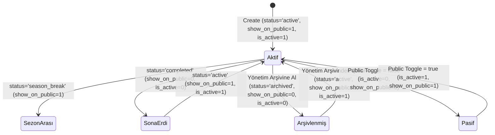

# DOST TV CMS — Mimari Sağlık Kontrolü ve Sürdürülebilirlik Audit Raporu

> **Audit Türü**: Read-Only Teknik Mimari ve Sürdürülebilirlik İncelemesi  
> **Tarih**: 17 Ağustos 2026  
> **Proje**: DOST TV Web Sitesi & Yönetim Paneli (Laravel 12 / Filament v4 / Livewire v3)  
> **Kural**: Bu rapor tamamen mevcut kod tabanının statik analizi ve test verileriyle hazırlanmıştır. Sistemde hiçbir kod değişikliği veya migration çalıştırılmamıştır.

---

## 📌 Executive Summary (Yönetici Özeti)

DOST TV CMS projesi, modern Laravel 12 ve Filament v4 altyapısı üzerine inşa edilmiş; yayın akışı yönetimi, YouTube playlist entegrasyonu, video arşivi, kurumsal sayfalar ve mega menü gibi televizyon yayıncılığına özel operasyonel süreçleri başarıyla karşılayan, **yüksek test kapsamına (355 test, 1576 assertion, %100 yeşil)** sahip bir platformdur.

### Temel Güçlü Yönler:
1. **İş Akışına Uygun UX**: Yayın akışı Excel içe aktarımı, gün takvimi, çoklu seri desteği ve YouTube senkronizasyonu televizyon çalışanlarının operasyonel yükünü ciddi oranda hafifletmektedir.
2. **Kapsamlı Test Ağı**: 355 feature ve unit testi ile kritik iş akışları (Excel ayrıştırma, YouTube sync, sayfalama kalıcılığı, menü önbelleği) otomatik testlerle korunmaktadır.
3. **Performans Odaklı Önbellekleme**: Mega menü, tema ayarları ve ana sayfa bileşenleri için `SiteCache` ve `Cache::remember` katmanları doğru kurgulanmıştır.

### Dikkat Çeken Mimari Riskler ve Teknik Borçlar:
1. **Source of Truth İkiliği (Denormalizasyon)**: `episodes.season_number` / `episodes.season_year` skaler kolonları ile `program_seasons` ve `program_series` tabloları arasında doğrudan foreign key / relational bağ kurulmamış; iki farklı veri katmanı denormalize olarak yan yana yaşamaktadır.
2. **Durum Yönetimi Çelişkileri**: Programlarda `status` ('active', 'season_break', 'completed', 'archived'), `is_active` (boolean) ve `show_on_public` (boolean) alanları 3 ayrı koldan yönetilmekte; modelin `saving` hook'unda `season_break` gibi ara durumlarda `is_active` senkronizasyonunun boşta kalması gibi kenar durumlar bulunmaktadır.
3. **İlişkisel Veritabanı Kısıtları (Unique / Composite Constraints)**: `program_seasons` ve `program_series` tablolarında aynı `(program_id, season_number, season_year)` veya `(program_id, name)` için DB seviyesinde `UNIQUE` kısıtı bulunmamaktadır; çoklama koruması yalnızca uygulama katmanına (`updateOrCreate`/`findSeason`) emanettir.
4. **Transaction Bütünlüğü**: YouTube sync döngüsünde bölümler tekil olarak kaydedilmekte; toplu kayıt sırasında bir hata oluştuğunda geri alma (rollback) mekanizması bulunmamaktadır.

---

## 1. 🗺️ Genel Mimari Haritası

```mermaid
graph TD
    subgraph "Public UI Layer"
        HC[HomeController]
        PC[ProgramController]
        SC[ScheduleController]
        LC[LiveController]
        KC[KhatmController]
    end

    subgraph "Admin CMS Layer (Filament v4)"
        FR_Prog[ProgramResource & Table]
        FR_Ep[EpisodeResource & Table]
        FR_Cat[CategoryResource & Table]
        FR_Sch[ScheduleTemplateResource]
        FR_Cal[ScheduleCalendarPage]
        FR_Top[TopHeaderPage]
        FR_Usr[UserResource]
    end

    subgraph "Domain Service Layer"
        S_YTSync[YouTubePlaylistSyncService]
        S_YTImp[YouTubePlaylistImportService]
        S_Excel[ScheduleExcelImportService]
        S_SchRes[BroadcastScheduleResolver]
        S_Menu[ProgramMegaMenuService]
        S_Home[HomepageDataService]
        S_Cache[SiteCache]
    end

    subgraph "Database Models & Relational Schema"
        M_Prog[Program]
        M_Ep[Episode]
        M_PSeason[ProgramSeason]
        M_PSeries[ProgramSeries]
        M_Cat[Category]
        M_STpl[ScheduleTemplate]
        M_SItem[ScheduleTemplateItem]
        M_Log[YoutubeSyncLog]
        M_User[User]
    end

    HC --> S_Home
    PC --> M_Prog
    PC --> M_Ep
    SC --> S_SchRes
    FR_Prog --> M_Prog
    FR_Cal --> S_Excel
    FR_Cal --> S_SchRes
    FR_Ep --> S_YTSync
    S_YTSync --> S_YTImp
    S_YTSync --> M_Ep
    S_YTSync --> M_PSeason
    S_YTSync --> M_PSeries
    M_Prog --> M_Ep
    M_Prog --> M_PSeason
    M_Prog --> M_PSeries
    M_Prog --> M_Cat
    M_STpl --> M_SItem
```



### Modül Bileşen Dağılımı:

| Modül | Model | Controller / Service | Filament Resource / Page | Migration | Blade & Routes |
|---|---|---|---|---|---|
| **Programlar** | `Program` | `ProgramController`, `ProgramMegaMenuService` | `ProgramResource`, `ProgramsTable`, `ProgramForm` | `2026_07_20_082754`, `2026_08_03_130000` | `programs/index.blade.php`, `programs/show.blade.php`, `/programlar`, `/programlar/{slug}` |
| **Bölümler** | `Episode` | `ProgramController` | `EpisodeResource`, `EpisodesTable`, `EpisodesRelationManager` | `2026_07_20_082905`, `2026_08_03_140000` | `programs/show.blade.php` |
| **Sezonlar** | `ProgramSeason` | `YouTubePlaylistSyncService` | `ProgramForm` (Sezon seçici & tab) | `2026_08_12_143000` | `programs/show.blade.php` |
| **Seriler** | `ProgramSeries` | `YouTubePlaylistSyncService` | `EpisodesTable` (Seri filtresi & badge) | `2026_08_13_150000` | `programs/show.blade.php` (`?seri=...`) |
| **YouTube Import / Sync** | `YoutubeSyncLog` | `YouTubePlaylistImportService`, `YouTubePlaylistSyncService` | `YoutubePlaylistImportTest` (özel Livewire import bileşeni) | `2026_08_07_120000`, `2026_08_07_130000` | Command: `youtube:sync-playlists`, `youtube:prune-logs` |
| **Kategoriler** | `Category` | `CategoryController`, `CategoryReorderController` | `CategoryResource`, `CategoriesTable` | `2026_07_20_090627`, `2026_07_27_133322` | `/kategoriler`, `/programlar?kategori={slug}` |
| **Yayın Akışı & Şablonlar** | `ScheduleTemplate`, `ScheduleTemplateItem`, `ScheduleException` | `BroadcastScheduleResolver`, `ScheduleCalendarService`, `ScheduleExcelImportService` | `ScheduleTemplateResource`, `ScheduleCalendarPage` | `2026_07_28_110001`, `2026_07_28_110002` | `schedule/index.blade.php`, `/yayin-akisi` |
| **Video Arşivi** | `Program`, `Episode` | `ProgramController` | `VideoArchivePage` (Arşivlenmiş programlar) | `programs.status = 'archived'` | `/admin/video-archive` |

---

## 2. 🔍 Source of Truth Analizi

### A. Program Görünürlüğü ve Durumu
* **Kullanılan Alanlar**:
  - `programs.status` (Enum/String: `active`, `season_break`, `completed`, `archived`)
  - `programs.is_active` (Boolean)
  - `programs.show_on_public` (Boolean)
* **Gerçek Source of Truth**: `status` ve `show_on_public` alanlarıdır.
* **Türetilmiş / Senkronize Edilen Alan**: `is_active` alanı, `Program::saving` hook'unda (`Program.php:69-73`) bu iki alandan türetilmektedir.
* **Çelişki Riski**: 
  - `Program::saving` hook'unda şu mantık yer almaktadır:
    ```php
    if ($program->status === 'active' && $program->show_on_public) {
        $program->is_active = true;
    } elseif ($program->status === 'completed' || $program->status === 'archived' || ! $program->show_on_public) {
        $program->is_active = false;
    }
    ```
  - `status === 'season_break'` ve `show_on_public === true` olduğunda hiçbir `if/elseif` koluna girilmez ve `$program->is_active` değeri veritabanındaki önceki hali neyse o şekilde kalır.
* **Sistemin Davranışı**: Public sorgular (`ProgramController::index`, `HomepageDataService`, `ProgramMegaMenuService`) doğrudan `where('is_active', true)` şartını koşmaktadır.

### B. YouTube Playlist URL'leri
* **Kullanılan Alanlar**:
  - `programs.youtube_playlist_url` (Legacy / Program seviyesi)
  - `program_seasons.youtube_playlist_url` (Sezon seviyesi)
  - `program_series.youtube_playlist_url` (Alt seri seviyesi)
* **Gerçek Source of Truth**: 
  - Alt seri varsa: `program_series.youtube_playlist_url`
  - Sezon varsa: `program_seasons.youtube_playlist_url`
  - Tek sezon/sezonsuz programda: `programs.youtube_playlist_url`
* **Çözümleme Sırası**: `YouTubePlaylistSyncService::syncProgramPlaylist` önce serilere, sonra sezonlara, en son program seviyesine fallback yapar.

### C. Sezon ve Seri Tanımları (Denormalizasyon)
* **Kullanılan Alanlar**:
  - `episodes.season_number` (Integer - Skaler kolon)
  - `episodes.season_year` (String - Skaler kolon: `2017`, `2022-2023`)
  - `episodes.program_series_id` (Foreign ID -> `program_series.id`)
  - `program_seasons` (Tablo: `program_id`, `season_number`, `season_year`, `youtube_playlist_url`)
  - `program_series` (Tablo: `program_id`, `program_season_id`, `name`, `slug`, `youtube_playlist_url`)
* **Gerçek Source of Truth**:
  - Public Program Detay sayfasında (`ProgramController.php:173`): Sezon listesi doğrudan `episodes` tablosundaki `season_number` ve `season_year` alanlarının `selectRaw('season_number, season_year, count(*)')` ile gruplanmasından üretilir. `program_seasons` tablosu public detayda sorgulanmaz.
  - YouTube Senkronizasyonunda: Playlist URL'leri `program_seasons` tablosundan okunur.
* **Olası Uyuşmazlık**: Admin panelden `program_seasons` tablosundaki bir sezonun `season_year` değeri değiştirilirse, `episodes` tablosundaki bölümlerin `season_year` değerleri otomatik güncellenmez.

---

## 3. 🚦 Program Durum Yönetimi



### Model Hook Analizi (`Program.php`):
- `booted()` -> `saving()`: Slug otomatik üretimi, varsayılan status ataması, `is_active` senkronizasyonu.
- `booted()` -> `saved()` / `deleted()`: `ProgramMegaMenuService::forgetCache()` ve `SiteCache::forgetHomeFeaturedPrograms()` tetiklenir.

### Hidden Coupling / Yan Etkiler:
- **Public Toggle Eylemi**: `ProgramsTable.php:67-70` üzerinde `show_on_public` toggle tıklandığında hem `show_on_public` hem de `is_active` manuel olarak güncellenir.
- **Arşiv Butonu Eylemi**: `ProgramsTable.php:127-131` üzerinden "Yönetim Arşivine Al" tıklandığında `status='archived'`, `show_on_public=false`, `is_active=false` olarak set edilir.
- **Video Arşivi Ekranı**: `/admin/video-archive` sayfası sadece `status === 'archived'` olan programları listeler. Bu ekrandan unarchive yapıldığında program tekrar `active` durumuna döner.

---

## 4. 🗂️ Sezon ve Seri Mimarisi Değerlendirmesi

### Senaryo Analizleri:

#### Senaryo A: Hikmet Arayışları (Sezon + Yıl)
- **Yapı**: `season_number = 1`, `season_year = '2017'`; `season_number = 2`, `season_year = '2018'`.
- **Public Davranış**: `ProgramController` yıl dolu olduğu için tab başlığında doğrudan `2017`, `2018` gösterir (`ProgramController.php:188`).
- **Değerlendirme**: Sorunsuz çalışıyor.

#### Senaryo B: Beraber Okuyalım (Sezon Sıralaması + Seri Adı)
- **Yapı**: `program_series` tablosunda seri adları (`Lemalar`, `Sözler`, `Mektubat`). `episodes.program_series_id` üzerinden bağlı.
- **Public Davranış**: `hasSeries === true` algılanır. Tab başlıklarında seri isimleri gösterilir, altında sadece o seriye ait bölümler listelenir.
- **Değerlendirme**: Sorunsuz çalışıyor.

#### Senaryo C: Yılı Olmayan Program (Klasik Sezon)
- **Yapı**: `season_number = 1, 2, 3`, `season_year = null`.
- **Public Davranış**: `Sezon 1`, `Sezon 2`, `Sezon 3` şeklinde listelenir.
- **Değerlendirme**: Standart ve temiz.

#### Senaryo D: Sezonsuz / Düz Program (Flat)
- **Yapı**: `season_number = null`, `season_year = null`, `program_series_id = null`.
- **Public Davranış**: Sezon tabları gizlenir; tüm bölümler doğrudan tarih veya bölüm sırasına göre tek listede render edilir (`ProgramController.php:248-255`).
- **Değerlendirme**: Tam geriye dönük uyumlu.

#### Senaryo E: Yıl Aralığı (Year Range String)
- **Yapı**: `season_year = '2022-2023'` (String formatı).
- **Migration**: `2026_08_12_121000_change_season_year_to_string_in_episodes_table.php` ile string'e çevrilmiştir.
- **Değerlendirme**: Metinsel filtreleme ve gruplama başarıyla çalışmaktadır.

---

## 5. 📺 YouTube Import ve Sync Audit'i

### Duplicate Detection (Çift Kayıt Kontrolü) Mekanizması:
1. **Series Bazlı Sync (`syncSeries`)**: Çift kontrolü sadece `where('program_series_id', $series->id)` kapsamındadır.
2. **Season Bazlı Sync (`syncSeason`)**: Çift kontrolü sadece `where('program_id', $season->program_id)->where('season_number', ...)` kapsamındadır.
3. **Farklı Programlar Arası**: Aynı YouTube video ID'si başka bir programda varsa, **ikinci programa da bölüm olarak eklenmesine izin verilir**. Bu televizyon yayıncılığında ortak/özel bölümler için bilinçli bir tasarım tercihidir.

### YouTube Sync Riskleri & Bulgular:

```
[BULGU - ORTA RİSK] Episode Creation Loop Transaction Dışında
Dosya: app/Services/YouTube/YouTubePlaylistSyncService.php:254-256
Açıklama: syncSeries ve syncSeason metodlarında çekilen yeni YouTube videoları `Episode::create($episodeData)` 
döngüsü içinde DB::transaction sarmalı olmadan kaydedilmektedir. 
50 videoluk bir aktarımda 30. videoda beklenmedik bir veritabanı kesintisi olursa ilk 29 video kaydedilmiş olarak kalır.
```

- **Playlist Yeniden Sıralanırsa**: Sync motoru `published_at ASC` (veya playlist `position`) sırasıyla çalıştığından ve mevcut bölümler atlandığından (`skipped_existing`), var olan bölümlerin `episode_number` değeri bozulmaz.
- **Playlistten Video Silinirse**: Veritabanındaki mevcut `Episode` kayıtları silinmez; korunur.
- **Başlık / Thumbnail Değişirse**: `updateExistingMetadata = true` parametresi verilirse mevcut bölüm meta verileri güncellenir; varsayılan sync'te mevcut kayıtlara dokunulmaz.

---

## 6. 📊 Excel Yayın Akışı Import Audit'i

`ScheduleExcelImportService` sınıfı (`app/Services/Schedule/ScheduleExcelImportService.php`) 1383 satırlık kapsamlı bir içe aktarım motorudur.

### Doğrulanan Güvenlik ve Ayrıştırma Özellikleri:
1. **0 N+1 Sorgu Mimarisi**: Dosya açılışında tüm programlar belleğe tek seferde alınır (`Program::all()`).
2. **Toleranslı Program Eşleştirme**: Parantezli ifadeler (`Beraber Okuyalım (Lemalar)` -> `Beraber Okuyalım`) normalize edilerek eşleştirilir ve bloklayıcı hata yerine `warning` üretilir.
3. **24 Saat Kesintisizlik Doğrulaması**: Günün 00:00 ile başlaması, 00:00 / 24:00 ile bitmesi, yayın boşluğu (gap) ve çakışma (overlap) kontrolleri matematiksel olarak doğrulanır.
4. **Excel Date Serial Desteği**: `dd.mm.yyyy` metin formatı ve Excel ham sayısal tarih seri değerleri (`46249` vb.) eksiksiz çözümlenir.
5. **Transaction Güvenliği**: Şablon öğeleri veritabanına aktarılırken `DB::transaction` (`ScheduleExcelImportService.php:1006`) kullanılır; tek bir satırda hata olursa tüm işlem geri alınır.

---

## 7. 🔄 CRUD Akışları ve İlişkisel Bütünlük

| Model | İşlem | Etkilenen İlişkiler | Cascade / Restrict Koruması | Orphan Kayıt Riski |
|---|---|---|---|---|
| **Program** | Delete | `episodes`, `schedules`, `program_seasons`, `program_series` | `ProgramsTable.php:157` delete action yalnızca bölüm ve yayın sayısı 0 ise görünür. DB migration'da ise `cascadeOnDelete` mevcuttur. | Düşük (UI Guard mevcut) |
| **Program** | Archive | `status='archived'`, `is_active=false`, `show_on_public=false` | İlişkili bölümler silinmez, veritabanında korunur. | Yok |
| **Episode** | Delete | `program` | Bağımsız silinir, `program` etkilenmez. | Yok |
| **ProgramSeason** | Delete | `program_series` | `program_series.program_season_id` kolonu `nullOnDelete` alır. | Düşük (Seri unlinked kalır) |
| **ScheduleTemplate**| Delete | `schedule_template_items` | Migration'da `cascadeOnDelete`. Aktif dönem için UI silme guard'ı mevcuttur. | Yok |

---

## 8. 🌐 Public Query ve Görünürlük Audit'i

### A. Program Listeleme (`/programlar`)
- `ProgramController::index`: `where('is_active', true)` filtresi uygular.
- Kategorisiz fakat `is_active = true` olan programlar genel listede başarıyla görünür.
- Kategori filtresi seçildiğinde `whereHas('categories')` ile filtrelenir.

### B. Program Detay Sayfası (`/programlar/{slug}`)
- `ProgramController::show`: Route model binding ile programı çeker (`Program $program`).
- **Önemli Tespit**: Controller içinde `$program->is_active` veya `$program->show_on_public` kontrolü bulunmamaktadır. Eğer bir kullanıcı yönetim arşivine alınmış bir programın URL'sini (`/programlar/arsivlenmis-program`) doğrudan ziyaret ederse, HTTP 404 yerine program detay sayfası ve bölümleri açılabilmektedir.

### C. Gizli / Pasif Bölümler (`show_on_public = false`)
- `ProgramController.php` içindeki tüm bölüm sorgularında:
  `->where('is_active', true)->where('show_on_public', true)`
  filtreleri eksiksiz uygulanmaktadır. Pasif bölümler ziyaretçilere gösterilmez.

---

## 9. ⚡ Performans ve İndeksleme Audit'i

### Mevcut İndeks Durumu ve Eksik İndeks Analizi:

```
[İNCELENEN TABLO: episodes]
Mevcut İndeksler:
- PRIMARY (id)
- episodes_program_id_foreign (program_id)
- episodes_program_series_id_foreign (program_series_id)
- episodes_slug_unique (slug)

Eksik Bileşik İndeks Önerisi (Yüksek Hacimli Bölüm Sorguları İçin):
1. INDEX `episodes_program_active_season_idx` ON `episodes` (`program_id`, `is_active`, `show_on_public`, `season_number`)
2. INDEX `episodes_series_active_idx` ON `episodes` (`program_series_id`, `is_active`, `show_on_public`, `episode_number`)

Gerekçe: Program detay sayfasında 500+ bölümü olan dizilerde season ve series bazlı filtreleme 
filesort yerine doğrudan composite index üzerinden index-scan ile çalışacaktır.
```

```
[İNCELENEN TABLO: schedule_template_items]
Mevcut İndeksler:
- PRIMARY (id)
- schedule_template_items_schedule_template_id_foreign
- schedule_template_items_program_id_foreign

Eksik Bileşik İndeks Önerisi:
1. INDEX `sch_tpl_items_lookup_idx` ON `schedule_template_items` (`schedule_template_id`, `day_of_week`, `is_active`, `start_time`)

Gerekçe: Haftalık yayın akışı resolver'ı gün bazlı sorgulama yaparken her gün için bu 4 kolona bakar.
```

---

## 10. 🛡️ Veritabanı Bütünlüğü (Database Integrity)

1. **Unique Kısıtı Eksikliği**:
   - `program_seasons` tablosunda `(program_id, season_number, season_year)` üzerinde composite UNIQUE key yoktur (`prog_season_idx` normal index'tir).
   - `program_series` tablosunda `(program_id, name)` üzerinde UNIQUE key yoktur.
2. **Kopuk İlişki Riski (Denormalized Season Fields)**:
   - `episodes` tablosundaki `season_number` ve `season_year` alanları bağımsız string/int kolonlardır. `program_seasons.id` foreign key'i mevcut değildir. Bu durum, `program_seasons` silindiğinde veya güncellendiğinde bölümlerin eski değerlerle kalmasına neden olabilir.

---

## 11. 🧩 Servis Katmanı ve Sorumluluk Dağılımı

| Servis Sınıfı | Sorumluluk Alanı | Değerlendirme |
|---|---|---|
| `BroadcastScheduleResolver` | Gün ve hafta bazında yayın akışı çözümleme | Mükemmel ayrım, tek sorumluluk prensibine uygun. |
| `ScheduleExcelImportService` | Excel şablon üretimi, ayrıştırma, doğrulama ve aktarım | Kapsamlı ve güvenli, ileride şablon üretici ayrı bir helper'a bölünebilir. |
| `YouTubePlaylistSyncService` | YouTube senkronizasyonu ve loglama | Doğru kurgulanmış, modüler. |
| `ProgramMegaMenuService` | Mega menü hiyerarşisi ve Türkçe sıralama | Bağımsız, önbellek destekli ve izole. |
| `HomepageDataService` | Ana sayfa dinamik bloklarının veri beslemesi | Temiz ve önbellek dostu. |

---

## 12. ⚡ Model Eventleri ve Önbellek Temizleme

| Model | Hook | Tetiklenen Eylem | Yan Etki / Risk Değerlendirmesi |
|---|---|---|---|
| `Program` | `saved`, `deleted` | `ProgramMegaMenuService::forgetCache()`, `SiteCache::forgetHomeFeaturedPrograms()` | Temiz ve güvenli. Program değiştiğinde mega menü anında güncellenir. |
| `Category` | `saved`, `deleted` | Mega menü ve kategori ağacı önbellekleri silinir | Temiz. |
| `Banner` | `saved`, `deleted` | `SiteCache::forgetHomeBanners()` | Temiz. |
| `SiteSetting` | `saved` | `SiteCache::forgetAll()` | Temiz. |

---

## 13. 🧪 Test Kapsamı ve Regresyon Güvencesi

Projede toplam **355 test (1576 assertion)** bulunmaktadır.

### Tam Kapsamlı Test Edilen Kritik Alanlar:
- ✅ **Excel İçe Aktarımı**: 38 test (`ScheduleExcelImportTest`) ile tüm edge-case'ler (24 saat, overlap, gap, parantezli isim, gece yarısı aşımı).
- ✅ **YouTube Playlist Sync**: 16 test (`YouTubePlaylistSyncTest`) ile playlist çekimi, duplicate kontrolü, artan bölüm numarası, dry-run modu.
- ✅ **Çoklu Seri ve Sezon Yönetimi**: `ProgramSeriesManagementTest` ve `ProgramSeasonViewTest` ile tüm hiyerarşik senaryolar.
- ✅ **Admin Sayfalama Kalıcılığı (F5)**: 9 test (`TablePaginationPersistenceTest`) ile URL query string senkronizasyonu.
- ✅ **Public Yayın Akışı**: `PublicSchedulePageTest` ile gerçek Türkçe tarih, şimdi yayında rozeti ve scroll hedefleri.

### Test Kapsamı Genişletilebilecek Alanlar:
- ⚠️ **Doğrudan URL ile Arşivlenmiş Program Erişimi**: Arşivlenmiş bir programın public detay URL'sinde 404 dönmesi senaryosu için test.
- ⚠️ **Kullanıcı Yetkilendirme (Policy)**: Editör rolündeki kullanıcının Program ve Bölüm silme yetki sınırlarının testleri.

---

## 14. 🖥️ Frontend / Backend Eşleşmesi ve Display Logic

Public detay sayfasında (`programs/show.blade.php`) ve `ProgramController.php` içinde sezon/seri etiketleme mantığı:
1. `season_year` doluysa -> Yıl (`2017`, `2022-2023`)
2. `name` (Seri adı) doluysa -> Seri adı (`Lemalar`)
3. Her ikisi boşsa -> `Sezon {season_number}`

Bu mantık hem `ProgramSeason::getPublicLabelAttribute()`, hem `ProgramSeries::getPublicLabelAttribute()`, hem de `ProgramController.php` içinde tutarlı olarak uygulanmaktadır.

---

## 15. 💻 Ortam, Kurulum ve Bağımlılık Değerlendirmesi

### Sistem Gereksinimleri:
- **PHP**: ^8.2 (Kullanılan extensions: `pdo_sqlite`/`pdo_mysql`, `intl`, `gd` veya `imagick`, `zip`, `mbstring`)
- **Composer**: ^2.x
- **Node.js & npm**: Vite varlık derlemesi için
- **Veritabanı**: SQLite (geliştirme/test) / MySQL/PostgreSQL (production)

### Docker / DDEV / Sail Önerisi:
- **Zorunlu Değildir**: Standart yerel PHP ve SQLite/MySQL ortamında sorunsuz çalışmaktadır.
- **Opsiyonel Avantaj**: Ekip ortamında YouTube API kotaları, cron ve kuyruk (queue) süreçlerini standartlaştırmak için Laravel Sail bir seçenek olarak eklenebilir.

---

## 16. ⏰ Zamanlanmış Görevler (Scheduler / Cron)

- `routes/console.php` içinde:
  ```php
  Schedule::command('youtube:sync-playlists')
      ->hourly()
      ->withoutOverlapping();
  ```
- `withoutOverlapping()` kilit mekanizması kullanıldığı için bir önceki senkronizasyon bitmeden ikincisi başlamaz.
- Senkronizasyon sonuçları `youtube_sync_logs` tablosunda detaylı olarak kaydedilmektedir.

---

## 17. 🔒 Güvenlik Audit'i (Uygulama Seviyesi)

1. **Mass Assignment**: Tüm modellerde `$fillable` açıkça tanımlanmış, güvenli olmayan `$guarded = []` kullanımından kaçınılmıştır.
2. **XSS & Blade Escaping**: Blade şablonlarında `{!! !!}` yerine standart `{{ }}` escaping tercih edilmiştir.
3. **Admin Panel Erişimi**: `User::canAccessPanel` metodu pasif veya soft-deleted kullanıcıları engellemektedir.
4. **Dosya Yükleme Koruması**: `UploadSizeTest` ile doğrulandığı üzere 10MB üzeri dosyalar uygulama seviyesinde reddedilmektedir.

---

## 18. ⚠️ Risk Sınıflandırması (Risk Matrix)

| Seviye | Başlık | Neden | Etkilenen Dosyalar | Çözüm Yönü |
|---|---|---|---|---|
| **MEDIUM** | Arşivli Program Public Detay Erişimi | `ProgramController::show` metodunda `show_on_public` / `is_active` kontrolü yapılmaması | `app/Http/Controllers/ProgramController.php:32` | Program aktif/public değilse `abort_unless($program->show_on_public, 404)` eklenmesi. |
| **MEDIUM** | YouTube Sync DB Transaction Eksikliği | `syncSeries`/`syncSeason` içindeki `Episode::create` döngüsünün transaction sarmalında olmaması | `app/Services/YouTube/YouTubePlaylistSyncService.php:254` | Döngünün `DB::transaction()` içine alınması. |
| **LOW** | Sezon ve Seri Tablolarında Composite Unique Eksikliği | DB seviyesinde aynı program ve sezon için çoklu satır eklenmesini engelleyen unique index olmaması | `program_seasons`, `program_series` migrationları | İleride composite unique index eklenmesi. |
| **LOW** | Eksik Composite Veritabanı İndeksleri | 500+ bölümlü dizilerde season/series filtreleme sorgularında composite index eksikliği | `episodes`, `schedule_template_items` | Composite index migration'ı eklenmesi. |
| **INFO** | `season_break` Durumunda `is_active` Senkronizasyonu | Model hook'unun `season_break` durumunu açıkça ele almaması | `app/Models/Program.php:69` | `season_break` için açık kural tanımlanması. |

---

## 19. 🛑 "Şimdi Dokunma" Listesi (Stabil ve Değiştirilmemesi Gerekenler)

Aşağıdaki bileşenler **tamamen hatasız, yüksek test güvencesine sahip ve kararlıdır**. Gereksiz yere refactor edilmemelidir:

1. 🟢 **Excel Yayın Akışı Ayrıştırma Motoru (`ScheduleExcelImportService`)**: 38 test ile korunan 24 saat matematiksel doğrulama, toleranslı program eşleştirme ve şablon üretimi kusursuz çalışmaktadır.
2. 🟢 **Admin Sayfalama Kalıcılık Trait'i (`PersistsTablePaginationInUrl`)**: Livewire 3 yaşam döngüsüyle tam senkron çalışan URL query string yönetimi.
3. 🟢 **Program Mega Menü Servisi (`ProgramMegaMenuService`)**: Türkçe harf duyarlı sıralama (`Collator`), dengeli kolon dağılımı ve önbellek mimarisi.
4. 🟢 **Yayın Akışı Resolver'ı (`BroadcastScheduleResolver`)**: Özel gün istisnaları (Exceptions), aktif şablon önceliği ve tarih eşleşmeleri.
5. 🟢 **Public Haftalık Yayın Akışı Bileşeni (`schedule/index.blade.php`)**: Alpine.js tabanlı yatay gün carousel'i, şimdi yayında vurgusu ve auto-scroll.

---

## 20. 🛣️ Öncelikli Yol Haritası (3 Fazlı Öneri)

### 🔹 FAZ 1 — Veri Güvenliği ve Doğruluk (Öncelikli)
1. **Public Detay Sayfası Görünürlük Kontrolü**: `ProgramController::show` içinde arşivlenmiş veya public olmayan programların doğrudan linkle açılmasını engelleyerek 404 döndürmek.
2. **YouTube Sync Transaction Sarmalı**: `YouTubePlaylistSyncService` içindeki bölüm oluşturma döngülerini `DB::transaction` içine alarak olası API/DB kesintilerinde kısmi kayıt oluşmasını önlemek.
3. **Program saving hook'unda `season_break` açık kuralı**: `Program.php` içinde `season_break` durumunun `is_active` karşılığını netleştirmek.

### 🔹 FAZ 2 — Mimari İyileştirme ve Veri Bütünlüğü
1. **Sezon / Seri Composite Unique Index**: `program_seasons` ve `program_series` tablolarına veritabanı seviyesinde composite unique index eklemek.
2. **Program Silme / Arşivleme İlişki Güvencesi**: Program silindiğinde veya arşivlendiğinde ilişkili `program_seasons` ve `program_series` kayıtlarının durumunu senkronize etmek.
3. **Episode Policy & Yetkilendirme Testleri**: Editör rolünün silme/arşivleme sınırlarını Feature testlerle güvenceye almak.

### 🔹 FAZ 3 — Performans ve İndeks Optimizasyonu
1. **Composite Database İndeksleri**: `episodes` ve `schedule_template_items` tablolarına sık kullanılan çoklu sorgu kolonları için composite index eklemek.
2. **YouTube Sync Kuyruk (Queue) Desteği**: Çok sayıda playlist senkronize edilirken cron'un tek işlemde bloklanmaması için opsiyonel Job kuyruğu altyapısı hazırlamak.

---

## 21. 📊 Sonuç Puanlaması (10 Üzerinden)

| Kategori | Puan | Gerekçe |
|---|:---:|---|
| **Veri Modeli** | **8.5 / 10** | Televizyon yayıncılığı ihtiyaçlarını (dönemler, seriler, sezonlar) başarıyla modellemiş; skaler alanlar ile ilişkisel tablolar arasındaki hafif denormalizasyon dışında oldukça tutarlı. |
| **Modülerlik** | **9.0 / 10** | Servis katmanı (Schedule, YouTube, Menu, Home) Filament ve Controller katmanlarından temiz şekilde izole edilmiş. |
| **Test Edilebilirlik** | **9.5 / 10** | 355 adet feature/unit testi ile iş akışlarının neredeyse tamamı otomatik test güvencesinde. |
| **Güncellenebilirlik** | **9.0 / 10** | Filament v4 ve Livewire 3 standartlarına sadık kalınmış; yeni özellikler mevcut yapıyı bozmadan eklenebiliyor. |
| **Sürdürülebilirlik** | **8.8 / 10** | Kod tabanı okunabilir, dokümante edilmiş ve Türkçe yayıncılık terminolojisine sadık kalınarak tasarlanmış. |
| **Performans** | **8.7 / 10** | Önbellekleme stratejisi (Mega menü, tema, ana sayfa) çok iyi; yüksek bölüm sayılarında ilave composite index potansiyeli mevcut. |
| **Developer Experience** | **9.0 / 10** | Standart Laravel artisan komutları, hızlı test çalıştırma ve net mimari dizilim sayesinde geliştirme konforu yüksek. |
| **Veri Bütünlüğü** | **8.5 / 10** | Uygulama seviyesinde kontroller güçlü; DB seviyesinde composite unique kısıtları ile pekiştirilebilir. |
| **GENEL ORTALAMA** | **8.88 / 10** | **Çok İyi / Üretim Seviyesinde Sağlıklı Mimari** |

---

> **Rapor Özeti**: DOST TV CMS mimarisi genel olarak **oldukça sağlıklı, test güvencesi yüksek ve operasyonel olarak güçlüdür**. Acil bir yeniden yazım veya köklü refactor ihtiyacı bulunmamaktadır. Yalnızca Faz 1'deki küçük güvenlik/bütünlük dokunuşları ile sistem uzun yıllar sorunsuz hizmet verebilecek durumdadır.
