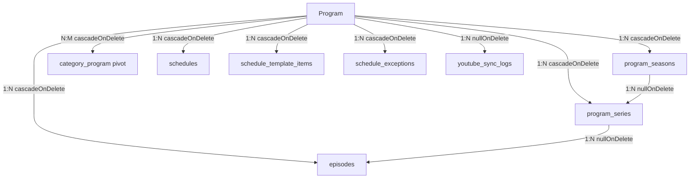

# DOST TV CMS — FAZ 2 / Program Silme, Arşivleme ve Sezon/Seri İlişki Bütünlüğü Analiz Raporu

> **Audit Türü**: Read-Only İlişki Bütünlüğü, Yaşam Döngüsü (Lifecycle), Arşivleme ve Silme Analizi  
> **Tarih**: 17 Ağustos 2026  
> **Proje**: DOST TV Web Sitesi & CMS  
> **İnceleme Durumu**: Read-Only (Hiçbir kod, migration veya veritabanı kaydı değiştirilmemiştir).

---

## 1. 🗺️ Program Model İlişki Haritası

`App\Models\Program` modelinin ilişkisel bağımlılıkları ve DB kısıtları:



| İlişkili Model / Tablo | İlişki Türü | Eloquent Metodu | DB Foreign Key Davranışı |
|---|---|---|---|
| **`episodes`** | 1:N | `hasMany(Episode::class)` | `cascadeOnDelete()` |
| **`program_seasons`** | 1:N | `hasMany(ProgramSeason::class)` | `cascadeOnDelete()` |
| **`program_series`** | 1:N | `hasMany(ProgramSeries::class)` | `cascadeOnDelete()` |
| **`categories`** | N:M | `belongsToMany(Category::class)` | `category_program` pivotu `cascadeOnDelete()` |
| **`schedules`** | 1:N | `hasMany(Schedule::class)` | `cascadeOnDelete()` |
| **`schedule_template_items`** | 1:N | `hasMany(ScheduleTemplateItem::class)` | `onDelete('cascade')` |
| **`schedule_exceptions`** | 1:N | `hasMany(ScheduleException::class)` | `onDelete('cascade')` |
| **`youtube_sync_logs`** | 1:N | `hasMany(YoutubeSyncLog::class)` | `onDelete('set null')` |

---

## 2. 📦 Yönetim Arşivine Al (Archive) Davranışı

Admin panelindeki **"Yönetim Arşivine Al"** (`ProgramsTable.php:120-136`) aksiyonu incelenmiştir.

### Gerçekleşen Alan Değişiklikleri:
```php
$record->update([
    'status' => 'archived',
    'show_on_public' => false,
    'is_active' => false,
]);
```

### İlişkisel Verilerin Korunma Durumu:
- **`Episodes`**: Hiçbir bölüm silinmez, güncellenmez veya başlığı bozulmaz. Bölümlerin `show_on_public` ve `is_active` alanları veritabanında **aynı kalır**.
- **`ProgramSeasons`**: Sezon kayıtları, sezon yılları ve YouTube playlist eşleşmeleri **tamamen korunur**.
- **`ProgramSeries`**: Seri kayıtları, slug'ları ve sıra numaraları **tamamen korunur**.
- **`Playlist URL'leri`**: Program, sezon ve serideki tüm playlist bağlantıları **aynı kalır**.
- **`Schedules & Şablonlar`**: Geçmiş ve mevcut yayın akışı kayıtları silinmez.
- **`Categories`**: Kategori pivot bağlantıları (`category_program`) korunur.
- **`Public Arayüz Etkisi`**:
  - `/programlar` listesinden gizlenir.
  - Mega menü ve anasayfa öne çıkanlardan çıkarılır.
  - Doğrudan URL erişiminde (`/programlar/{slug}`) ziyaretçilere `404 Not Found` verilir; oturum açmış adminler için önizleme (`200 OK`) korunur.

---

## 3. 🔄 Yönetim Arşivinden Çıkar (Unarchive / Restore) Davranışı

Admin panelindeki **"Yönetim Arşivinden Çıkar"** (`ProgramsTable.php:138-153`) aksiyonu incelenmiştir.

### Gerçekleşen Alan Değişiklikleri:
```php
$record->update([
    'status' => 'active',
    'show_on_public' => true,
    'is_active' => true,
]);
```

### Geri Dönüş ve Bütünlük Doğrulaması:
- **İlişkilerin Durumu**: Arşivleme sırasında hiçbir alt veri (bölüm, sezon, seri) silinmediği için, arşivden çıkarma anında tüm bölümler, sezonlar ve seriler **sıfır veri kaybı ile anında eksiksiz geri gelir**.
- **Bölüm Public Durumu**: Bölümlerin bireysel görünürlük ayarları arşiv öncesindeki özgün durumunu korur.
- **Playlist Sync**: Program aktif duruma geçtiği için gerek manuel butonla gerekse otomatik senkronizasyonla hemen çalışmaya devam eder.
- **Public URL**: `/programlar/{slug}` adresi anında `200 OK` olarak yayına açılır.

---

## 4. 🛑 Program Silme (Delete) Davranışı ve Güvenlik Kalkanı

Admin panelindeki **Sil (Delete)** aksiyonu (`ProgramsTable.php:155-158`) incelenmiştir:

```php
DeleteAction::make()
    ->requiresConfirmation()
    ->visible(fn (Program $record) => $record->episodes()->count() === 0 && $record->schedules()->count() === 0),
```

### Senaryo Bazlı Davranış Matrisi:

| Senaryo | UI'da Sil Butonu Görünürlüğü | Silme İsteği Gelirse DB Davranışı | Açıklama |
|---|:---:|:---:|---|
| **A. 0 Bölüm, 0 Yayın Akışı (Tamamen Boş)** | 🟢 **Görünür** | ✅ Güvenle Silinir | Pivot ve log kayıtları temizlenir. |
| **B. 1 veya Daha Fazla Bölümü Var** | 🔴 **GİZLİ (Engellenir)** | ⚠️ DB'de Cascade Var | Yanlışlıkla bölümleriyle birlikte silinmesi UI katmanında kesin olarak engellenir. |
| **C. ProgramSeason var, 0 Bölüm, 0 Schedule** | 🟢 **Görünür** | ✅ Program ve Sezonu Silinir | `program_seasons` cascadeOnDelete ile temizlenir. |
| **D. ProgramSeries var, 0 Bölüm, 0 Schedule** | 🟢 **Görünür** | ✅ Program ve Serisi Silinir | `program_series` cascadeOnDelete ile temizlenir. |
| **E. Schedule / Template İlişkisi Var** | 🔴 **GİZLİ (Engellenir)** | ⚠️ DB'de Cascade Var | Yayın akışını bozmamak için UI'da silme butonu gösterilmez. |
| **F. Kategori Pivotu Var (Bölüm/Yayın 0)** | 🟢 **Görünür** | ✅ Pivot Temizlenir | Kategori varlığı silmeye engel değildir; kategori etkilenmez. |

> **Önemli Güvenlik Tespiti**: DOST TV panelinde editörün yüzlerce bölümü olan bir programı yanlışlıkla tek tıkla silmesi **UI seviyesinde tam kilit altındadır**. Yalnızca gerçekten boş olan programlar silinebilir; dolu programlar için yalnızca **"Yönetim Arşivine Al"** yolu açıktır.

---

## 5. 🔗 Foreign Key Davranışı ve Migration İncelemesi

Tüm migration dosyaları incelenerek foreign key kısıtları doğrulanmıştır:

| Tablo & Kolon | Hedef Tablo | Migration Tanımı | Davranış |
|---|---|---|---|
| `program_seasons.program_id` | `programs.id` | `cascadeOnDelete()` | Program silinirse sezonları da silinir. |
| `program_series.program_id` | `programs.id` | `cascadeOnDelete()` | Program silinirse serileri de silinir. |
| `program_series.program_season_id` | `program_seasons.id` | `nullOnDelete()` | Sezon silinirse seri yetim kalmaz, `program_season_id = NULL` olur. |
| `episodes.program_id` | `programs.id` | `cascadeOnDelete()` | Program silinirse bölümleri silinir. |
| `episodes.program_series_id` | `program_series.id` | `nullOnDelete()` | Seri silinirse bölüm silinmez, `program_series_id = NULL` olur. |
| `category_program.program_id` | `programs.id` | `cascadeOnDelete()` | Program silinirse pivot satırı silinir (Kategori korunur). |
| `schedules.program_id` | `programs.id` | `cascadeOnDelete()` | Program silinirse schedule silinir. |
| `schedule_template_items.program_id` | `programs.id` | `onDelete('cascade')` | Program silinirse şablon satırı silinir. |
| `youtube_sync_logs.program_id` | `programs.id` | `onDelete('set null')` | Program silinirse log kaydı korunur, program bağı koparılır. |

---

## 6. 🕵️ Yetim (Orphan) Kayıt Riski Değerlendirmesi

1. **Program silinirse Sezon / Seri kalır mı?**:
   - **Hayır**. `program_seasons` ve `program_series` tablolarındaki `cascadeOnDelete` kuralı sayesinde program silindiğinde veritabanı motoru sezon ve serilerini otomatik ve temiz bir şekilde siler. Yetim sezon/seri kalmaz.
2. **ProgramSeries silinirse Episode `program_series_id` yetim kalır mı?**:
   - **Hayır**. `episodes.program_series_id` kolonu `nullOnDelete()` olarak tanımlıdır. Seri silindiğinde bölümler silinmez, yalnızca seri bağı `NULL`'a çekilerek bağımsız sezon/genel bölüm olarak korunur.
3. **ProgramSeason silinirse Seri veya Bölüm bağlantısı kopar mı?**:
   - **Hayır**. `program_series.program_season_id` `nullOnDelete()` olduğu için seri silinmez; yalnızca genel seri statüsüne geçer.
4. **Schedule kaydı program silinince ne olur?**:
   - DB seviyesinde cascade mevcuttur; ancak UI kuralı gereği yayın akışında kaydı olan program zaten **silinemez**.

---

## 7. 🗂️ Admin Grup Sil Aksiyonu İncelemesi

Bölümler listesindeki Sezon/Seri Grup Silme aksiyonu (`EpisodesTable.php:475-568`) incelenmiştir:

- **Çalışma Prensibi**:
  1. Yalnızca hedeflenen `(program_id, season_number, season_year, program_series_id)` grubuna ait bölümleri siler.
  2. Başka bölümler tarafından kullanılmayan `ProgramSeries` kaydı varsa temizler.
  3. Başka bölüm veya seriler tarafından kullanılmayan `ProgramSeason` kaydı varsa temizler.
- **Program Korunması**: **Program kaydının kendisine KESİNLİKLE dokunulmaz.**
- **Transaction Güvencesi**: Tüm işlem tek bir `DB::transaction` içerisinde atomik olarak yürütülür.

---

## 8. ⚖️ Arşivleme vs. Silme Ayrımı

| Kriter | Yönetim Arşivine Al (Archive) | Sil (Delete) |
|---|---|---|
| **Amaç** | Yayından kaldırma, yayını biten programı koruma | Yanlışlıkla açılmış boş/hatalı kaydı temizleme |
| **Bölüm / Medya Verisi** | **%100 Korunur** | Temizlenir |
| **Sezon / Seri Verisi** | **%100 Korunur** | Temizlenir |
| **Geri Alınabilirlik** | **Tek tıkla anında geri alınabilir** | Geri alınamaz (Kalıcı silme) |
| **Kullanım Şartı** | Herhangi bir programda kullanılabilir | Yalnızca 0 Bölüm ve 0 Yayın Akışı olanlarda |
| **Kod Çakışması** | Yok (Tamamen ayrık ve net sorumluluk) | Yok |

---

## 9. 👁️ Program Public Toggle Davranışı

`ProgramsTable.php` üzerindeki **Public (👁 Yayında / ⊘ Pasif)** butonu:
- Yalnızca `program.show_on_public` ve türetilmiş `program.is_active` alanlarını günceller.
- Altındaki `ProgramSeason`, `ProgramSeries` veya `Episode` satırlarının veritabanı değerlerini **asla mutasyona uğratmaz**.
- Program tekrar "Yayında" yapıldığında altındaki tüm bölümler önceki görünürlüklerini koruyarak anında yayına döner.

---

## 10. 📺 Episode Public Durumu ve Süzme Mantığı

- `episodes.show_on_public` ve `episodes.is_active` kolonları **bölüm seviyesinde bağımsızdır**.
- Bir program pasife veya arşive alındığında altındaki 500 bölümün `show_on_public` kolonları tek tek `false` yapılmaz.
- Bunun yerine **Program Seviyesi Güvenlik Kalkanı** devreye girer:
  - `ProgramController::show` metodu programın `show_on_public` veya `status === 'archived'` durumunu kontrol eder ve doğrudan `abort(404)` verir.
  - Ziyaretçi bölümlere ulaşamaz.
- Program yeniden aktif edildiğinde, daha önce özel olarak gizlenmiş (örneğin telifli veya yayından kaldırılmış) tekil bölümler varsa bu durumları bozulmadan korunur.

---

## 11. 📡 YouTube Playlist Sync ve Arşivlenmiş Program Davranışı

### Mevcut Durum Analizi:
`YouTubePlaylistSyncService::syncAllPlaylists` metodu incelendiğinde:
- Playlist URL'si tanımlı olan tüm `ProgramSeries` ve `ProgramSeason` kayıtlarını tarar.
- Şu anda `whereHas('program', fn($q) => $q->where('status', '!=', 'archived'))` filtresi **bulunmamaktadır**.
- Dolayısıyla program yönetim arşivinde olsa dahi otomatik saatlik sync çalışır ve YouTube'a yeni video yüklenirse veritabanına `Episode` kaydı ekler.

### Değerlendirme & Tavsiye:
1. **Mevcut Davranışın Avantajı**: Televizyon kanalı bir programı yayından kaldırıp arşivlemiş olsa bile, YouTube kanalındaki video arşivi DOST TV CMS veritabanında eksiksiz ve güncel kalmaya devam eder. Arşivden çıkarıldığı gün hiçbir video kaybı yaşanmaz.
2. **Öneri (Seçenek A - Tavsiye Edilen)**:
   - **Saatlik Otomatik Sync**: Arşivlenmiş programlar için YouTube API kota tasarrufu sağlamak adına saatlik genel sync'ten hariç tutulabilir (`status != 'archived'`).
   - **Manuel Sync**: Admin Bölümler ekranından "YouTube'dan Güncelle" butonuna bastığında arşivlenmiş olsa bile editör isteğiyle manuel sync çalışmaya devam etmelidir.

---

## 12. 🗓️ Yayın Akışı (Schedule) Etkisi

- **Arşivlenmiş Program**:
  - Arşivleme programın `show_on_public` değerini `false` yapar.
  - Yayın akışı şablonlarında (`ScheduleTemplateItem`) program adı `custom_title` veya `program->name` üzerinden sorunsuz render edilmeye devam eder.
  - Ziyaretçi yayın akışında program adını ve saatini görür; ancak program detayına tıklarsa gizli/arşivli olduğu için 404 koruması devreye girer.
- **Silinmiş Program**:
  - UI kuralı nedeniyle yayın akışı kaydı olan program **kesinlikle silinemez**. Böylece yetim yayın akışı oluşması engellenmiştir.

---

## 13. 🧪 Test Kapsamı ve Eksik Test Senaryoları Analizi

### Mevcut Testler:
- ✅ `PublicProgramVisibilityGuardTest` (404 guard & admin preview)
- ✅ `ProgramStateSyncAndVisibilityMatrixTest` (Durum geçişleri ve is_active türetimi)
- ✅ `ProgramSeasonSeriesUniqueConstraintsTest` (Sezon/Seri unique kısıtları)
- ✅ `YouTubePlaylistTransactionTest` (Transaction bütünlüğü)

### İlave Edilebilecek Yaşam Döngüsü (Lifecycle) Testleri:
1. `test_archiving_program_preserves_episodes_seasons_and_series_intact()`
2. `test_unarchiving_program_restores_full_visibility_without_data_mutation()`
3. `test_program_with_episodes_cannot_be_deleted_via_filament_action()`
4. `test_program_with_schedules_cannot_be_deleted_via_filament_action()`
5. `test_empty_program_deletion_cascades_empty_seasons_and_series_cleanly()`
6. `test_public_toggle_does_not_mutate_underlying_episode_records()`

---

## 14. 📊 Bütünlük ve Davranış Sonuç Tablosu

```text
================================================================================
DOST TV CMS — PROGRAM İLİŞKİ VE YAŞAM DÖNGÜSÜ MATRİSİ
================================================================================

YÖNETİM ARŞİVİNE AL (ARCHIVE)
- Program       : status='archived', show_on_public=false, is_active=false
- Episodes      : KORUNUR (Satırlar ve public flag'leri mutasyona uğramaz)
- ProgramSeasons: KORUNUR (Sezon yılları ve playlist URL'leri tam kalır)
- ProgramSeries : KORUNUR (Seri isimleri, slug'ları ve sıraları tam kalır)
- Categories    : KORUNUR (Pivot bağlantıları aynen kalır)
- Schedule      : KORUNUR (Yayın akışı geçmişi bozulmaz)
- Playlist URL  : KORUNUR (Hiçbir bağlantı sıfırlanmaz)
- Sync          : Manuel çalışabilir / Otomatik kota yönetimi önerilir

YÖNETİM ARŞİVİNDEN ÇIKAR (UNARCHIVE / RESTORE)
- Program       : status='active', show_on_public=true, is_active=true
- Episodes      : ANINDA AKTİF (Tüm bölümler özgün haliyle yayına döner)
- ProgramSeasons: ANINDA AKTİF (Tüm sezonlar eksiksiz görünür)
- ProgramSeries : ANINDA AKTİF (Tüm alt seriler eksiksiz görünür)
- Playlist URL  : ANINDA AKTİF (YouTube sync kaldığı yerden devam eder)
- Public URL    : /programlar/{slug} anında 200 OK yanıt verir

DELETE (KALICI SİLME)
- Hangi Koşulda : YALNIZCA 0 Bölüm ve 0 Yayın Akışı kaydı olduğunda
- Engelleyenler : Episode > 0 veya Schedule > 0 ise silme butonu GİZLENİR
- Cascade Olan  : Boş ProgramSeasons, boş ProgramSeries, Category pivot
- Orphan Riski  : SIFIR (DB cascade ve nullOnDelete ile tam koruma)
================================================================================
```

---

## 15. 🚥 Risk Sınıflandırması

| Seviye | Konu | Neden | Etki |
|---|---|---|---|
| **INFO** | Arşivleme Veri Güvenliği | Arşivleme sırasında hiçbir alt kayıt silinmez veya değiştirilmez | %100 Güvenli & Geri Alınabilir |
| **INFO** | Silme UI Koruması | Dolu programların silinmesi UI katmanında kilitlenmiştir | Yanlışlıkla veri kaybı riski sıfıra indirilmiştir |
| **LOW** | Arşivli Program Sync Kotası | Arşivlenmiş programların saatlik otomatik sync'te taranması | Fazladan YouTube API kotası harcanabilir |
| **INFO** | Foreign Key Yapısı | `nullOnDelete` ve `cascadeOnDelete` kuralları eksiksizdir | Yetim (orphan) kayıt riski bulunmamaktadır |

---

## 16. 💡 Mimari Tavsiyeler ve Sonuç

1. **Mevcut Cascade Yapısına Dokunulmamalıdır**: Veritabanı seviyesindeki foreign key cascade kuralları ve UI seviyesindeki silme engeli (`count === 0`) mükemmel bir denge oluşturmaktadır.
2. **Arşiv Sırasında Sezon/Seri Mutasyonu Yapılmamalıdır**: Mevcut yapı veriyi %100 koruduğu için arşivleme esnasında alt tablolara müdahale edilmemelidir.
3. **Sync Kota İyileştirmesi (Opsiyonel / İleride)**: `YouTubePlaylistSyncService::syncAllPlaylists` sorgusuna `whereHas('program', fn($q) => $q->where('status', '!=', 'archived'))` eklenerek arşivli programlar otomatik saatlik taramadan çıkarılabilir, manuel sync butonu ise korunabilir.

---

*Bu rapor [FAZ2_PROGRAM_RELATION_LIFECYCLE_AUDIT.md](file:///Users/mac/Dost%20TV%20Web%20Site/FAZ2_PROGRAM_RELATION_LIFECYCLE_AUDIT.md) adıyla proje köküne kaydedilmiştir. Hiçbir kod veya şema değişikliği yapılmamıştır.*
