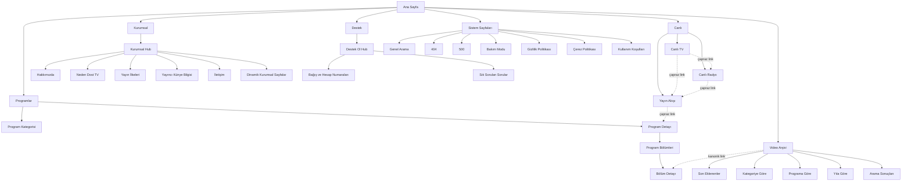

# Dost TV — Bilgi Mimarisi Yeniden Tasarım Raporu

**Temel alınan doküman:** [ux_audit_report.md](ux_audit_report.md)
**Tarih:** 27 Temmuz 2026
**Kapsam:** Yalnızca bilgi mimarisi (IA) tasarımı — bu raporda hiçbir kod veya dosya değişikliği yapılmamıştır.
**Teknik zemin:** Laravel 12, PHP 8.4, Filament v4 admin, Blade + Alpine.js public frontend (Livewire yalnızca admin panelde), SQLite.

---

## 1. Bilgi Mimarisi Hedefleri

| Hedef | Ne anlama geliyor |
|---|---|
| **İçerik keşfi** | Kullanıcı ne aradığını tam olarak bilmese bile — taksonomi (program/kategori/yıl) veya arama yoluyla — içeriğe ulaşabilmeli. Tek bir keşif yoluna (yalnızca editoryal sıralama) bağımlı olunmayacak. |
| **Canlı yayın erişimi** | Canlı TV, Canlı Radyo ve Yayın Akışı; sitenin her sayfasından en fazla 1 tıkla ulaşılabilen, birbirine bağlı tek bir "canlı yayın ekosistemi" olarak davranacak. |
| **Mobil kullanılabilirlik** | Mobil, masaüstünün "küçültülmüş hali" değil, birincil kullanım şekli olarak tasarlanacak; tüm IA mobilde eksiksiz erişilebilir olacak. |
| **SEO** | Her bağımsız içerik birimi (program, bölüm, kurumsal sayfa) kendi URL'ine, başlığına, meta açıklamasına ve yapılandırılmış verisine (JSON-LD) sahip olacak. |
| **Sosyal paylaşım** | Her paylaşılabilir birim (özellikle bölümler) Open Graph verisiyle donatılacak; paylaşılan link başlıksız/görselsiz görünmeyecek. |
| **Editoryal yönetilebilirlik** | Menü grupları, sıralama, görünürlük gibi IA kararları admin panelinden veri olarak yönetilecek; yeni bir sayfa/program eklemek kod değişikliği gerektirmeyecek. |
| **Ölçeklenebilirlik** | Yapı, bugünkü 10-20 programdan yüzlerce programa, birkaç düzine bölümden binlerce bölüme çıkıldığında da (filtre + arama + sayfalama ile) kullanılabilir kalacak. |
| **Erişilebilirlik** | WCAG 2.1 AA hedefiyle klavye, dokunmatik ve ekran okuyucu kullanıcıları için eşdeğer erişim sağlanacak. |
| **Üç tıklama kuralı** | Ana sayfadan; bir canlı yayına, bir programa, bir bölüme, bir kurumsal bilgiye ve bağış bilgisine en fazla 3 tıkla ulaşılabilecek. |

---

## 2. Hedef Kullanıcı Grupları — Giriş Noktaları ve Navigasyon Yolları

| Kullanıcı grubu | En uygun giriş noktası | Önerilen navigasyon yolu |
|---|---|---|
| Canlı TV izlemek isteyen | Header'daki sabit "Canlı İzle" CTA'sı, doğrudan `/canli-tv` | Herhangi bir sayfa → Header CTA → Canlı TV (1 tık) |
| Canlı radyo dinlemek isteyen | Header "Canlı" menüsü → Canlı Radyo, veya sitenin herhangi bir yerindeki kalıcı mini-player | Herhangi bir sayfa → Canlı menüsü → Canlı Radyo (2 tık) veya mini-player üzerinden anında (0 tık, zaten çalıyorsa) |
| Belirli bir programı arayan | Header "Programlar" veya arama ikonu | Ana Sayfa → Programlar → (opsiyonel kategori/arama) → Program Detayı (2-3 tık) |
| Belirli bir bölümü/konuşmacıyı arayan | Arama (header ikonu) veya Video Arşivi | Ana Sayfa → Arama/Video Arşivi → filtre (konuşmacı/kategori) → Bölüm Detayı (2-3 tık) |
| Eski yayınları izlemek isteyen | Video Arşivi → "Yıla Göre" veya Program → Bölümler | Ana Sayfa → Video Arşivi → Yıl filtresi → Bölüm Detayı (3 tık) |
| Bugünkü yayın akışını görmek isteyen | Ana sayfa "Bugünkü Yayın Akışı" widget'ı veya "Canlı" menüsü → Yayın Akışı | Ana Sayfa → widget (0 tık, ana sayfada zaten görünür) veya → Canlı → Yayın Akışı (2 tık) |
| Kurumsal bilgi arayan | Header "Kurumsal" menüsü | Ana Sayfa → Kurumsal → Kurumsal Hub veya doğrudan alt sayfa (2 tık) |
| Bağış yapmak isteyen | Header'daki vurgulu "Destek Ol" CTA'sı | Herhangi bir sayfa → Destek Ol → Bağış ve Hesap Numaraları (2 tık) |
| Mobil ziyaretçi | Hamburger menü + header'daki hızlı erişim butonları (Canlı TV/Radyo) | Hamburger aç → ilgili bölüm (1-2 tık, masaüstüyle eşdeğer derinlik) |
| Arama motorundan doğrudan bir video sayfasına gelen | Google/sosyal medya → doğrudan `/programlar/{program}/bolum/{episode}` | Sayfa içinde: program bağlantısı, "benzer bölümler", breadcrumb ve header navigasyonu ile siteye "yeniden giriş" (0 ek tık ile bağlam kaybı yaşamadan devam) |

---

## 3. Yeni Ana Navigasyon (Masaüstü)

Kullanıcının önerdiği yapı büyük ölçüde doğru; iki iyileştirme yapıldı: **(a)** "Arama" ayrı bir menü öğesi değil, her zaman görünür bir **ikon-tetikli** eleman olarak header'a alındı (menüde yer kaplamaması ve her sayfadan erişilebilir olması için); **(b)** "Destek Ol", diğer menü öğeleriyle aynı görsel ağırlıkta bir link değil, **"Canlı İzle" ile aynı seviyede ama farklı renkte bir CTA butonu** olarak öne çıkarıldı — çünkü UX Audit'te bağış görünürlüğünün düşük olması ayrı bir kritik bulguydu (bkz. ux_audit_report.md, madde 9, 12).

| Menü Etiketi | Hedef URL | Alt Menüler | Kullanıcı Amacı | Mobilde Gösterim | Aktif Sayfa Durumu | Klavye Erişilebilirliği |
|---|---|---|---|---|---|---|
| **Dost TV** (logo) | `/` | — | Marka kimliği, ana sayfaya dönüş | Solda sabit logo | — | Standart link, `Tab`/`Enter` |
| **Canlı** | `/canli-tv` (başlığa tıklama da TV'ye götürür) | Canlı TV, Canlı Radyo, Yayın Akışı | Canlı izleme/dinleme/akış görme merkezi | Accordion başlık, altında 3 link | `routeIs('live.*')` veya `routeIs('schedule.index')` ise grup vurgulu | `button[aria-haspopup="true"][aria-expanded]`; `Enter`/`Space` açar, `Esc` kapatır, ok tuşlarıyla alt öğe gezilir |
| **Programlar** | `/programlar` | — | Program bazlı keşif | Tek link | `routeIs('programs.*')` | Standart link |
| **Video Arşivi** | `/video-arsivi` | — | Bölüm bazlı keşif (arama/filtre) | Tek link | `routeIs('archive.*')` | Standart link |
| **Kurumsal** | `/kurumsal` | Hakkımızda, Neden Dost TV, Yayın İlkeleri, Yayıncı Künye Bilgisi, İletişim | Kurumsal/regülasyon bilgisi | Accordion başlık, altında dinamik sayfa listesi | `routeIs('corporate.*')` | `button[aria-haspopup="true"]`; **hem `:focus-within` hem `click` ile açılır** (yalnızca hover değil — UX Audit madde 3/4 düzeltmesi) |
| **Ara** (ikon) | `/arama` (overlay açılır, submit ile sayfaya gider) | — | Hızlı, site geneli arama | Header'da her zaman görünen büyüteç ikonu | — | `button[aria-label="Ara"]`, `Enter` overlay açar, overlay içinde `Esc` kapatır |
| **Destek Ol** (CTA, amber) | `/destek-ol` | (dropdown yok; sayfa içinde Bağış ve Hesap Numaraları, SSS bölümleri) | Bağış çağrısını öne çıkarmak | Menü açıldığında en altta sabit vurgulu buton + header'da küçük ikon | `routeIs('support.*')` | Standart buton-link, belirgin `focus-visible` halkası |
| **Canlı İzle** (CTA, rose, pulse) | `/canli-tv` | — | Anlık canlı yayına geçiş | Header'da her zaman sağda sabit | — | Standart buton-link |

---

## 4. Mobil Navigasyon (< 1024px)

**Genel yaklaşım:** Off-canvas menü (tam ekran değil) — sağdan açılan, ekranın ~%85-90'ını kaplayan bir panel. Tam ekran yerine off-canvas tercih edilmesinin nedeni: arka planda kalan sayfanın kısmen görünür/karartılmış (overlay) kalması, kullanıcıya "bağlamdan hiç çıkmadım" hissi vermesi ve overlay'e dokunarak hızlı kapatma imkânı sağlamasıdır.

- **Hamburger butonu:** Header'da sağ üstte, logo ile "Canlı İzle" CTA'sı arasında değil, CTA'nın da sağında en dışta. İkon açıkken çarpı (X) ikonuna dönüşür. `aria-expanded="false|true"`, `aria-controls="mobile-menu"`, kapalıyken `aria-label="Menüyü aç"`, açıkken `aria-label="Menüyü kapat"`.
- **Off-canvas panel:** `role="dialog" aria-modal="true" aria-label="Site menüsü"`. Alpine `x-show` + `x-transition` ile sağdan kayarak açılır (`translate-x-full` → `translate-x-0`).
- **Açılma/kapanma davranışı:** Hamburger tıklanınca panel açılır ve arka planda `bg-black/60` overlay belirir. Overlay'e tıklama veya panel içindeki "Kapat" (X) butonu paneli kapatır.
- **Alt menü accordion yapısı:** "Canlı" ve "Kurumsal" başlıkları tıklanınca chevron ikonu 180° döner ve alt linkler aşağı açılır; her ikisi bağımsız çalışır (biri açıkken diğeri kapanmak zorunda değil), böylece kullanıcı iki grubu da aynı anda inceleyebilir.
- **Canlı TV hızlı erişim:** Panelin en üstünde, tam genişlikte, pulse noktalı büyük birincil buton ("● Canlı TV İzle").
- **Canlı Radyo hızlı erişim:** Hemen altında, ikincil (outline) stilde tam genişlik buton ("Dost FM Dinle").
- **Arama alanı:** Panel açılır açılmaz en üstte (hızlı erişim butonlarının üstünde veya hemen altında) bir arama input'u; `autofocus` **kullanılmaz** (iOS/Android'de menü animasyonu sırasında klavyenin aniden açılmasını önlemek için) — kullanıcı input'a dokununca klavye açılır.
- **Bağış butonu:** Panelin en altında, diğer tüm linklerden görsel olarak ayrışan (amber/altın renk) sabit bir "Destek Ol" butonu.
- **Menü kapanırken odak yönetimi:** Panel kapatıldığında (X, overlay veya Esc ile) odak otomatik olarak hamburger butonuna geri döner (`$refs.menuButton.focus()`), böylece klavye kullanıcısı sayfada "kaybolmaz".
- **ESC ile kapanma:** `@keydown.escape.window="open = false"` — panel her zaman `Esc` ile kapatılabilir.
- **Body scroll kilidi:** Panel açıkken `<body>` öğesine `overflow-hidden` sınıfı eklenir (Alpine `x-effect="document.body.classList.toggle('overflow-hidden', open)"`), arka plan sayfası kaymaz.
- **Arka plan overlay:** Yarı saydam karartma (`bg-black/60`), tıklanabilir, `aria-hidden="true"`.
- **Ekran okuyucu etiketleri:** Hamburger `aria-label`, panel `aria-modal`+`aria-label`, kapat butonu `aria-label="Menüyü kapat"`, accordion başlıkları `aria-expanded` ile durumunu bildirir, arama input'u `aria-label="Site içinde ara"`.

### Mobil Menü — Metin Tabanlı Wireframe

```
┌─────────────────────────────────────┐
│  Dost TV                    [☰]      │  ← Header (kapalı durum)
└─────────────────────────────────────┘

  [☰] tıklanınca sağdan açılır:

┌───────────────────────┬─────────────┐
│ (karartılmış arka plan)│  DOST TV [X]│  ← panel başlığı + kapat
│                        ├─────────────┤
│                        │ 🔍 Ara...    │  ← arama input
│                        ├─────────────┤
│                        │ [● Canlı TV  │  ← birincil CTA (dolu)
│                        │    İzle]     │
│                        │ [ Dost FM    │  ← ikincil CTA (outline)
│                        │   Dinle ]    │
│                        ├─────────────┤
│                        │ Ana Sayfa    │
│                        │ ▸ Canlı      │  ← accordion (kapalı)
│                        │ Programlar   │
│                        │ Video Arşivi │
│                        │ ▸ Kurumsal   │  ← accordion (kapalı)
│                        ├─────────────┤
│                        │ [Destek Ol]  │  ← alt sabit, vurgulu buton
└───────────────────────┴─────────────┘

  "▸ Canlı" tıklanınca (▾ olur):

│ ▾ Canlı              │
│   Canlı TV            │
│   Canlı Radyo          │
│   Yayın Akışı          │
```

---

## 5. Yeni Site Haritası

### Hiyerarşik Liste

```
Ana Sayfa (/)
├── Canlı
│   ├── Canlı TV (/canli-tv)
│   ├── Canlı Radyo (/canli-radyo)
│   └── Yayın Akışı (/yayin-akisi)
├── Programlar (/programlar)
│   ├── Program Kategorisi (/programlar?kategori=...)
│   ├── Program Detayı (/programlar/{program})
│   │   ├── Program Bölümleri (/programlar/{program}/bolumler)
│   │   └── Bölüm Detayı (/programlar/{program}/bolum/{episode})
├── Video Arşivi (/video-arsivi)
│   ├── Son Eklenenler (/video-arsivi?sort=en-yeni)
│   ├── Kategoriye Göre (/video-arsivi/kategori/{category})
│   ├── Programa Göre (/video-arsivi?program={program})
│   ├── Yıla Göre (/video-arsivi/yil/{year})
│   ├── Arama Sonuçları (/video-arsivi?q=...)
│   └── Bölüm Detayı → (kanonik: /programlar/{program}/bolum/{episode})
├── Kurumsal (/kurumsal)
│   ├── Kurumsal Ana Sayfa (hub, /kurumsal)
│   ├── Hakkımızda (/kurumsal/hakkimizda)
│   ├── Neden Dost TV (/kurumsal/neden-dost-tv)
│   ├── Yayın İlkeleri (/kurumsal/yayin-ilkeleri)
│   ├── Yayıncı Künye Bilgisi (/kurumsal/yayinci-kunye-bilgisi)
│   ├── İletişim (/iletisim — üst seviye kısayol, içerik olarak Kurumsal grubunda)
│   └── Dinamik kurumsal içerik sayfaları (/kurumsal/{slug})
├── Destek (/destek-ol)
│   ├── Destek Ol (hub, /destek-ol)
│   ├── Bağış ve Hesap Numaraları (/destek-ol/hesap-numaralari veya aynı sayfada bölüm)
│   └── Sık Sorulan Sorular (/destek-ol/sss)
└── Sistem Sayfaları
    ├── Genel Arama (/arama)
    ├── 404 (özel view)
    ├── 500 (özel view)
    ├── Bakım Modu (özel view, `php artisan down` ekranı)
    ├── Gizlilik Politikası (/kurumsal/gizlilik-politikasi)
    ├── Çerez Politikası (/kurumsal/cerez-politikasi)
    └── Kullanım Koşulları (/kurumsal/kullanim-kosullari)
```

### Mermaid Diyagramı



---

## 6. URL ve Route Yapısı

**Genel kural:** Catch-all `/{page:slug}` rotası kaldırılır (yeni üst seviye rotalarla — `video-arsivi`, `destek-ol` vb. — çakışma riski taşıdığı için); kurumsal sayfalar artık `/kurumsal/{slug}` altında, açık bir prefix ile tanımlanır.

| Route Name | HTTP Method | Controller/Action | Model Binding | Sayfa Amacı | Canonical Yaklaşımı | Eski URL / Redirect |
|---|---|---|---|---|---|---|
| `home` | GET `/` | `HomeController@index` | — | Ana sayfa | Kendisi kanonik | — |
| `live.tv` | GET `/canli-tv` | `LiveController@tv` | — | Canlı TV | Kendisi kanonik | Değişmedi |
| `live.radio` | GET `/canli-radyo` | `LiveController@radio` | — | Canlı Radyo | Kendisi kanonik | Değişmedi |
| `schedule.index` | GET `/yayin-akisi` | `ScheduleController@index` | — | Haftalık yayın akışı | Kendisi kanonik | Değişmedi |
| `programs.index` | GET `/programlar` | `ProgramController@index` | — | Program listesi + kategori filtresi | `?kategori=` varyantları `/programlar`'ı kanonik gösterir (veya kategori sayfaları için ayrı canonical, bkz. Bölüm 8) | Değişmedi |
| `programs.show` | GET `/programlar/{program:slug}` | `ProgramController@show` | `Program` (route key `slug`) | Program detayı | Kendisi kanonik | Değişmedi |
| `programs.episodes` | GET `/programlar/{program:slug}/bolumler` | `ProgramController@episodes` | `Program` | Programın tüm bölümlerinin sayfalanmış listesi (bölüm sayısı çoksa) | Kendisi kanonik | Yeni rota |
| `programs.episode.show` | GET `/programlar/{program:slug}/bolum/{episode:slug}` | `EpisodeController@show` | `Program` + scoped `Episode` (aşağıya bakınız) | Bölüm detay/izleme sayfası | Kendisi kanonik (tek doğru URL, arşivden de buraya link verilir) | Yeni rota — eski yapıda hiç yoktu |
| `archive.index` | GET `/video-arsivi` | `ArchiveController@index` | — | Genel video arşivi, tüm filtreler burada birleşir | `q`, `sort` gibi parametreler kanonikten hariç tutulur (`rel=canonical` temel URL'e) | Yeni rota |
| `archive.category` | GET `/video-arsivi/kategori/{category:slug}` | `ArchiveController@category` | `Category` | Kategoriye göre bölüm listesi | Kendisi kanonik | Yeni rota |
| `archive.year` | GET `/video-arsivi/yil/{year}` | `ArchiveController@year` | `{year}` (int, `where('year','[0-9]{4}')`) | Yıla göre bölüm listesi | Kendisi kanonik | Yeni rota |
| `search.index` | GET `/arama` | `SearchController@index` | — | Site geneli arama sonuçları | `q` parametresiyle birlikte `noindex` (arama sonucu sayfaları indekslenmez) | Yeni rota |
| `corporate.hub` | GET `/kurumsal` | `CorporatePageController@hub` | — | Kurumsal sayfaların listelendiği hub | Kendisi kanonik | Yeni rota |
| `corporate.show` | GET `/kurumsal/{page:slug}` | `CorporatePageController@show` | `Page` (scope: `menu_group=kurumsal`) | Tekil kurumsal sayfa | Kendisi kanonik | **Redirect gerekli:** eski `/{slug}` (`yayinci-kunye-bilgisi`, `dost-tv-yayin-ilkeleri`, `neden-dost-tv`) → `/kurumsal/{slug}` (301) |
| `contact.show` | GET `/iletisim` | `CorporatePageController@show` (aynı controller, sabit slug `iletisim`) | `Page` | İletişim sayfası (üst seviye kısayol) | Kendisi kanonik | Eski `/iletisim` zaten aynı — redirect gerekmez |
| `support.index` | GET `/destek-ol` | `SupportController@index` | — | Destek Ol hub sayfası (bağış CTA + IBAN + SSS) | Kendisi kanonik | **Redirect gerekli:** eski `/dost-vakfi-hesap-numaralari` → `/destek-ol` (301) |

**Episode slug ve çakışma önleme yaklaşımı:**
- `episodes` tablosuna `slug` sütunu eklenir; **global değil, program bazlı benzersizlik** uygulanır: `unique(['program_id', 'slug'])` veritabanı kısıtı.
- Slug üretimi `Program` modelindeki mevcut mantıkla aynı desende: `Str::slug($title)`; aynı program içinde çakışma olursa (`booted()` `saving` event'inde) `-2`, `-3` gibi bir sayısal sonek otomatik eklenir (mevcut `Program`/`Category`/`Page` modellerindeki slug üretim deseniyle tutarlı, ek bir kütüphane gerekmez).
- Route model binding: Laravel'in **scoped implicit binding**'i kullanılır — rota tanımı `Route::get('/programlar/{program:slug}/bolum/{episode:slug}', ...)` şeklinde nested tanımlandığında, `Episode` modelinde `program()` ilişkisi mevcut olduğundan Laravel otomatik olarak `episode`'u ilgili `program`'a scoplar (`Route::scopeBindings()` grup sarmalayıcısı ile açıkça etkinleştirilmesi önerilir). Bu sayede `/programlar/haber-bulteni/bolum/gunun-ozeti` ile `/programlar/baska-program/bolum/gunun-ozeti` aynı slug'ı taşısa bile birbirine karışmaz; yanlış programın altında doğru olmayan bir bölüm slug'ı verilirse 404 döner (güvenlik + doğruluk).

---

## 7. Program ve Bölüm Mimarisi

**Temel prensip:** Program = "dizi/koleksiyon" seviyesi (SEO'da `Series`/`Organization` benzeri), Episode = "izlenebilir birim" seviyesi (SEO'da `VideoObject`). Her ikisi de kendi kimliğine, URL'ine ve meta verisine sahiptir; biri diğerinin "gizli alt bileşeni" değildir.

### Program Detay Sayfasında (`/programlar/{program}`) bulunacak bilgiler
- Program adı, kapak görseli, kategori(ler), açıklama
- Fragman (varsa) — **bölümlerden görsel olarak ayrı bir "Fragman" etiketiyle** oynatıcıda gösterilir, otomatik olarak "1. bölüm" ile karıştırılmaz
- Yayın saatleri (haftalık akıştan gelen)
- Son 6-8 bölümün özet grid'i + "Tüm Bölümleri Gör" linki (`programs.episodes`'a gider; bölüm sayısı azsa bu grid zaten tüm bölümleri kapsar ve ayrı sayfaya gerek kalmaz)
- Benzer programlar (aynı kategori(ler)i paylaşan, editoryal `sort_order`'a göre 4-6 program)
- Paylaşım butonu (program sayfasının kendi URL'i için)

### Bölüm Detay Sayfasında (`/programlar/{program}/bolum/{episode}`) bulunacak bilgiler
- Video oynatıcı (kaynağa göre YouTube/HLS/upload — bkz. aşağıdaki tutarlılık kararı)
- Bölüm başlığı, yayın tarihi, süre (`duration`)
- Konuşmacı/sunucu (varsa)
- Ait olduğu program adı + kapak (üstte küçük bir "şerit", programa geri dönüş linki)
- Kategori/etiket rozetleri (programdan miras + bölüme özel etiketler, faz 3)
- Bölüm açıklaması (tam metin — mevcut altyapıda veritabanında olup hiç gösterilmeyen alan)
- Önceki bölüm / Sonraki bölüm gezinme (aynı program içinde `sort_order`'a göre)
- Benzer bölümler (aynı kategori/program, editoryal + en yeni karışımı)
- Paylaşım butonu (bu bölümün kendi kanonik URL'i için — sosyal medya paylaşımının asıl hedefi)
- Video altyazısı/transkript (varsa — faz 3, WCAG ve SEO'ya doğrudan katkı)

### Fragman ile bölüm arasındaki fark
Fragman, `Program.trailer_url` alanından gelir ve kavramsal olarak "programın tanıtımı"dır — bağımsız bir `Episode` kaydı **değildir**, kendi URL'i/SEO'su yoktur, yalnızca program detay sayfasında oynatıcının varsayılan içeriği olarak sunulur. Bölümler ise her biri kendi URL'ine sahip, arşivde ve arama sonuçlarında bağımsız olarak görünebilen birimlerdir. Bugünkü karışıklığın kaynağı (program sayfası açılınca fragman mı ilk bölüm mü oynayacağı belirsizliği) şu şekilde çözülür: program sayfasında oynatıcı **her zaman fragmanı** gösterir (varsa); fragman yoksa "Bu programın fragmanı henüz eklenmedi, bölümleri izlemek için aşağıdan seçin" mesajı + ilk bölüme link gösterilir. Program sayfasında episode oynatma tamamen kaldırılır — bölüm izlemek isteyen kullanıcı bölüm kartına tıkladığında **kendi URL'ine sahip bölüm sayfasına** yönlendirilir (JS ile aynı sayfada video değiştirme yerine gerçek sayfa geçişi).

### YouTube, HLS ve upload kaynaklarının sunumu
Kaynak türünden bağımsız olarak bölüm detay sayfasında **tek, tutarlı bir oynatıcı çerçevesi** kullanılır: aynı boyut, aynı üst/alt bilgi şeridi (başlık, süre, paylaşım butonu oynatıcının hemen dışında, kaynağa göre değişmez). Kaynağın kendisi (YouTube iframe / HLS `<video>` / upload `<video>`) çerçevenin içinde değişir ama kullanıcı çevresindeki bilgi ve aksiyon alanı (başlık, süre, önceki/sonraki, paylaş) her zaman aynı yerde ve aynı görünümdedir — böylece "hangi bölüm YouTube'dan hangisi kendi sunucudan geliyor" farkı kullanıcı deneyimini bozmaz.

---

## 8. Video Arşivi Bilgi Mimarisi

`/video-arsivi`, tüm bölümlerin (episode) tek bir yerde, program sınırı olmadan keşfedilebildiği sayfadır. Program detay sayfasındaki bölüm listesi "bu programın bölümleri", Video Arşivi ise "kanalın tüm bölümleri" anlamına gelir.

### Filtreler — önem sırasına göre, MVP / Faz 2-3 ayrımıyla

| Öncelik | Filtre | Aşama | Gerekçe |
|---|---|---|---|
| 1 | Arama kelimesi (`q`) | **MVP** | En yüksek etkili keşif yolu; kullanıcı ne aradığını çoğu zaman kelimeyle ifade eder |
| 2 | Programa göre | **MVP** | Zaten var olan ilişkiyi (Episode→Program) yeniden kullanır, düşük maliyetli |
| 3 | Kategoriye göre | **MVP** | Mevcut `Category` modeli üzerinden, ek geliştirme gerektirmez |
| 4 | En yeni / En eski (sıralama) | **MVP** | `aired_at`/`published_at` üzerinden basit `orderBy`, sıfır ek altyapı |
| 5 | Yayın yılı | **MVP** | `aired_at` üzerinden `whereYear`, basit ama yüksek değerli (arşiv derinliği hissi verir) |
| 6 | Kaynak türü (YouTube/HLS/upload) | Faz 2 | Kullanıcı için ikincil bir teknik detay; önce içerik bazlı filtreler önceliklenir |
| 7 | Konuşmacı/sunucu | Faz 2 | Veri modelinde alan yok, önce `speaker` alanı eklenmeli (bkz. Bölüm 15) |
| 8 | Video süresi (kısa/orta/uzun aralığı) | Faz 2 | `duration` alanı eklendikten sonra anlamlı hale gelir |
| 9 | A-Z (alfabetik) | Faz 2 | Düşük öncelik, "en yeni" kadar sık kullanılmaz |
| 10 | Editörün seçtikleri | Faz 2-3 | `is_featured` alanı ve editoryal küratörlük süreci gerektirir |
| 11 | Yayın tarihi (belirli gün aralığı seçimi) | Faz 3 | Tarih aralığı seçici UI karmaşıklığı MVP için gereksiz |

### Arşiv kartlarının göstermesi gereken bilgiler
- Küçük resim (thumbnail), süre rozeti (sağ alt köşe, `12:34` formatında)
- Bölüm başlığı
- Ait olduğu program adı (küçük, ikincil)
- Yayın tarihi (`d.m.Y` veya "3 gün önce" bağıl format)
- Kategori rozeti (varsa)
- Kaynak ikonu (YouTube/canlı kayıt — yalnızca küçük bir ikon, Faz 2)

### Query string yapısı — örnekler
```
/video-arsivi
/video-arsivi?sort=en-yeni
/video-arsivi?program=cuma-sohbetleri
/video-arsivi?kategori=dini-sohbetler         (veya kanonik: /video-arsivi/kategori/dini-sohbetler)
/video-arsivi/kategori/dini-sohbetler?sort=en-eski
/video-arsivi/yil/2024
/video-arsivi/yil/2024?program=cuma-sohbetleri
/video-arsivi?q=sabir+ve+tevekkul
/video-arsivi?q=sabir&kategori=dini-sohbetler&sort=en-yeni
```
**Kural:** Tekil taksonomi boyutları (kategori, yıl) temiz path segmentleri olarak kalır (SEO değeri yüksek, indekslenebilir sayfalar); bunların üzerine binen ikincil parametreler (`q`, `sort`, `program`) query string olarak eklenir ve bu kombinasyonlar için `canonical` etiketi, parametre olmadan en temel taksonomi URL'ine işaret eder (kopya içerik riskini önler).

---

## 9. Arama Mimarisi

**Kapsam:** Program adı/açıklaması, bölüm adı/açıklaması, kategori adı, konuşmacı/sunucu (Faz 2 alanı eklendikten sonra), kurumsal sayfa başlığı/içeriği.

**Sonuç grupları:** Arama sonuçları üç sekme/bölüm halinde sunulur — **Programlar**, **Videolar (Bölümler)**, **Kurumsal Sayfalar** — her grup kendi en alakalı 3-5 sonucunu gösterir, "tümünü gör" ile genişletilebilir (Video Arşivi'nde `q` parametresiyle devam eder).

- **Masaüstü deneyimi:** Header'daki büyüteç ikonuna tıklanınca sayfanın üstünde açılan bir arama kutusu/overlay (tam sayfa modal değil, hafif bir dropdown-panel); yazarken (debounce ile, ileride) veya `Enter` ile `/arama?q=...` sayfasına gider. MVP'de canlı öneri olmadan doğrudan sonuç sayfasına yönlendirme de kabul edilebilir bir başlangıçtır.
- **Mobil deneyim:** Hamburger menüsü açıldığında en üstte duran arama input'u; ayrıca `/arama` sayfasına doğrudan erişim (header'da her zaman görünen ikon).
- **Sonuç bulunamadı durumu:** Nötr bir mesaj + "Bunları deneyin: Programlar, Video Arşivi, Yayın Akışı" gibi alternatif keşif linkleri; kullanıcıyı boş sayfada bırakmaz.
- **Yazım hatası toleransı:** MVP'de yok (basit `LIKE` araması yazım hatasına duyarlıdır); Faz 3'te gelişmiş motora geçişle birlikte fuzzy/typo-tolerant arama eklenir.
- **Önerilen aramalar:** MVP'de yok; Faz 2'de en çok aranan/en popüler program adları statik bir liste olarak "popüler aramalar" şeklinde sunulabilir.
- **Son aramalar:** MVP'de yok (sunucu tarafı oturum yönetimi gerektirir); Faz 2'de `localStorage` tabanlı istemci-taraflı basit bir geçmiş (kişisel veri saklamadan) düşünülebilir.
- **Laravel + SQLite ile MVP arama yaklaşımı:** Ek bir arama motoru kurmadan, ilgili modeller üzerinde `WHERE title LIKE '%...%' OR description LIKE '%...%'` sorguları (Türkçe karakter normalizasyonu için `Str::lower` + gerekirse `str_replace` ile İ/ı, Ş/ş gibi karakterlerin normalize edilmesi) çalıştırılır; üç model (`Program`, `Episode`, `Page`) için ayrı sorgular yapılır ve sonuçlar PHP tarafında basit bir alaka sıralamasıyla (başlık eşleşmesi > açıklama eşleşmesi, sonra en yeni) birleştirilir. SQLite üzerinde bu yaklaşım, mevcut veri hacminde (onlarca-yüzlerce kayıt) performans sorunu yaratmaz.
- **İleride gelişmiş arama motoruna geçiş:** İçerik hacmi büyüdüğünde (binlerce bölüm) veya yazım toleransı/alaka sıralaması ihtiyacı arttığında, Laravel Scout üzerinden **TNTSearch** (SQLite-dostu, dosya tabanlı, ek sunucu gerektirmez — düşük operasyonel yük) veya üretim ölçeğinde **Meilisearch/Typesense** (tam fuzzy arama, çok daha hızlı, ayrı servis gerektirir) sürücülerine geçiş yapılabilir. Bu geçiş, arama mantığının Scout arkasına soyutlanmasıyla (bir `Searchable` trait) mevcut IA'yı (URL'ler, sonuç grupları) değiştirmeden yapılabilir.

*(Bu bölümde yalnızca mimari kararlar tanımlanmıştır, kod yazılmamıştır.)*

---

## 10. Canlı TV, Radyo ve Yayın Akışı İlişkisi

Bu üç modül, birbirinden bağımsız üç "adacık" olarak değil, **tek bir yayın ekosistemi** olarak tasarlanır. Ortak veri kaynağı: `Schedule` modeli (Faz 2'de `channel_type` alanıyla genişletilir, bkz. Bölüm 15).

### Canlı TV sayfasında (`/canli-tv`)
- **Şimdi yayında:** `Schedule` verisinden, bugünün gününe ve şu anki saate göre hesaplanan aktif program adı, oynatıcının hemen altında.
- **Sıradaki program:** Aynı hesaplamadan bir sonraki zaman diliminin programı.
- **Bugünkü yayın akışı:** Küçük bir liste/kart (ana sayfadaki widget'ın aynısı, yeniden kullanılabilir bir Blade component).
- **Program detay bağlantısı:** "Şimdi yayında" satırındaki program adı, o programın `/programlar/{program}` sayfasına link verir.
- **Radyo canlı bağlantısı:** Sayfanın altında/yanında "Dost FM'i de dinleyin" kısa CTA'sı.

### Canlı Radyo sayfasında (`/canli-radyo`)
- **Şimdi çalıyor:** Mümkünse ICY metadata, değilse yine `Schedule`'dan (radyo kanalına ait) hesaplanan program adı.
- **Radyo program akışı:** Radyo için ayrı/birleşik yayın akışı özeti.
- **Kalıcı mini-player yaklaşımı:** Radyo sayfasında başlatılan yayın, kullanıcı başka bir sayfaya geçtiğinde site genelinde alt kısımda sabit kalan bir mini-player'a devrolur (state, sayfa geçişleri arasında `localStorage`/Alpine `$persist` benzeri bir mekanizmayla veya basit bir `<audio>` elementinin layout'ta kalıcı olarak header/footer dışında tutulmasıyla korunur — Livewire olmadığından bu, tüm sayfalarda ortak bir Blade component + Alpine global store ile çözülür).
- **TV canlı bağlantısı:** "Canlı TV'yi izle" kısa CTA'sı.

### Yayın Akışı sayfasında (`/yayin-akisi`)
- **Şimdi yayında:** Aktif günün aktif saatindeki satır görsel olarak vurgulanır (kenarlık/rozet).
- **Canlı izle butonu:** Vurgulanan "şimdi yayında" satırının yanında doğrudan "Canlı İzle" mini-butonu.
- **Program detay bağlantısı:** Her satırdaki program adı zaten (mevcut kodda da olduğu gibi) `programs.show`'a link verir — korunur.
- **Gün seçimi:** Üstte yatay sekmeler (Pzt-Paz), varsayılan olarak "bugün" seçili gelir; mobilde yatay kaydırılabilir sekme çubuğu.
- **TV ve radyo akışlarının ayrımı:** `channel_type` alanı sayesinde sayfa iki sekme/bölüme ayrılır: "Dost TV Akışı" ve "Dost FM Akışı" — kullanıcı karışık bir listede hangi programın hangi kanalda olduğunu tahmin etmek zorunda kalmaz.

### Modüller arası iç linkler ve geçişler
```
Canlı TV ──"Dost FM'i dinle"──▶ Canlı Radyo
Canlı Radyo ──"Canlı TV'yi izle"──▶ Canlı TV
Canlı TV ──"Şimdi yayında: {program}"──▶ Program Detayı
Yayın Akışı ──"Canlı İzle" (şimdiki satır)──▶ Canlı TV
Yayın Akışı ──program adı──▶ Program Detayı
Ana Sayfa (Şimdi Yayında widget) ──▶ Canlı TV / Program Detayı
Program Detayı ──"Yayın Saatleri" kutusu──▶ Yayın Akışı (ilgili günü vurgulayarak)
Header "Canlı" menüsü ──▶ her üç sayfaya eşit erişim
```

---

## 11. Kurumsal İçerik Mimarisi

Mevcut `Pages` yapısındaki en büyük sorun, menü gruplamasının (`whereIn(['yayinci-kunye-bilgisi', ...])`) **kod içine slug olarak sabitlenmiş olmasıydı** — yeni bir sayfa eklendiğinde otomatik doğru yere düşmüyordu. Çözüm: gruplama tamamen veri odaklı hale getirilir.

### Değerlendirilen yeni alanlar

| Alan | Amaç |
|---|---|
| `parent_id` | Sayfalar arası hiyerarşi (ör. bir "SSS" sayfası "Destek Ol" hub'ının altında) |
| `menu_group` | Enum/string: `kurumsal`, `destek`, `sistem`, `null` (gruplanmamış) — header/footer render mantığı slug yerine bu alana bakar |
| `menu_location` | Enum: `header`, `footer`, `both`, `none` — bir sayfa header'da görünsün mü, yalnızca footer'da mı, hiç menüde görünmesin mi |
| `sort_order` | Zaten mevcut, grup içi sıralama için korunur |
| `show_in_header` / `show_in_footer` | `menu_location`'ın daha granüler/boolean alternatifi — ikisinden biri tercih edilir (öneri: `menu_location` enum'u, iki boolean yerine tek kaynak) |
| `is_published` | Taslak/yayında ayrımı — hazırlanan ama henüz yayınlanmayan kurumsal içerik için |
| `published_at` | Zamanlanmış yayın (ör. yeni bir yönetmelik belirli bir tarihte yürürlüğe girecekse) |
| `seo_title` / `seo_description` | Sayfa başlığından bağımsız, arama sonucu için özelleştirilmiş SEO başlığı/açıklaması |
| `og_image` | Sosyal paylaşımda görünecek görsel (yoksa site geneli varsayılan bir görsele düşer) |

### Kurumsal Hub Sayfası (`/kurumsal`)
Header'daki dropdown'ın bir web sayfası karşılığı: `menu_group = 'kurumsal'` olan tüm yayınlanmış sayfaların, `sort_order`'a göre kart/liste halinde sunulduğu bir dizin sayfası. Bu sayfa hem SEO açısından (kurumsal içeriklerin tek bir üst sayfadan linklendiği bir "hub") hem de kullanıcı açısından ("hepsini bir arada görmek istiyorum" senaryosu) değer katar.

### Yeni sayfa eklendiğinde doğru yere düşmesi için veri modeli mantığı
Admin, Filament `PageResource` formunda `menu_group` (Select: Kurumsal / Destek / Sistem / Yok) ve `menu_location` (Select: Header / Footer / Her ikisi / Hiçbiri) alanlarını doldurur. Header ve footer Blade bileşenleri artık **hiçbir slug'ı bilmez** — yalnızca `Page::where('menu_group', 'kurumsal')->where('menu_location', ...)->orderBy('sort_order')->get()` gibi veri odaklı sorgularla çalışır. Bu sayede yeni bir sayfa eklemek tamamen admin panelinden yapılan bir içerik işlemi haline gelir, kod değişikliği gerektirmez — UX Audit'in altıncı bulgusu (madde 6 / 30) doğrudan çözülür.

---

## 12. Header ve Footer Mimarisi

### Header
| Öğe | Konum | Not |
|---|---|---|
| Logo | Sol | Ana sayfaya link |
| Ana navigasyon | Logo'nun sağı, orta | Bölüm 3'teki yapı |
| Arama ikonu | Sağ, CTA'lardan önce | Overlay tetikler |
| Canlı TV butonu | Sağ, vurgulu (rose, pulse) | Her zaman görünür |
| Canlı Radyo göstergesi | Arama ile Canlı TV butonu arasında, küçük bir "🔴 Dost FM çalıyor" rozeti | **Yalnızca mini-player aktifken görünür** — radyo çalmıyorsa bu alan boş kalır (gereksiz görsel gürültü yaratmaz) |
| Destek Ol butonu | En sağ veya Canlı İzle'nin yanında, farklı renkte (amber) | Görünürlüğü artırmak için ikinci bir CTA |
| Mobil menü butonu | Yalnızca `< lg` ekranlarda, en sağda | Hamburger/X |

### Footer
| Kolon | İçerik |
|---|---|
| **Yayın** | Canlı TV, Canlı Radyo, Yayın Akışı |
| **İçerik** | Programlar, Video Arşivi |
| **Kurumsal** | Hakkımızda, Neden Dost TV, Yayın İlkeleri, Yayıncı Künye, İletişim (hepsi `menu_group='kurumsal'` sorgusundan otomatik) |
| **Destek** | Destek Ol, Bağış ve Hesap Numaraları, SSS |
| **Kurumsal/Yasal alt satır** | Telif metni, Gizlilik Politikası, Çerez Politikası, Kullanım Koşulları, Yayıncı künye (özet) |
| **Sosyal medya** | İkon satırı (YouTube, varsa Instagram/X) — `SiteSetting` modeline eklenecek sosyal medya alanlarından beslenir |

**Masaüstü:** 4-5 kolon yan yana (grid), en altta tek satır telif+yasal linkler+sosyal ikonlar.
**Mobil:** Kolonlar tek sütun halinde alt alta, her kolon başlığı tıklanabilir accordion olabilir (footer uzunluğunu azaltmak için, opsiyonel); sosyal ikonlar ve telif metni en altta ortalanmış tek satır olarak kalır.

---

## 13. Breadcrumb Yapısı

| Sayfa | Breadcrumb |
|---|---|
| Programlar | Ana Sayfa › Programlar |
| Program kategorisi | Ana Sayfa › Programlar › {Kategori Adı} |
| Program detayı | Ana Sayfa › Programlar › {Program Adı} |
| Bölüm detayı | Ana Sayfa › Programlar › {Program Adı} › {Bölüm Adı} |
| Video arşivi | Ana Sayfa › Video Arşivi |
| Video arşivi filtre sonuçları | Ana Sayfa › Video Arşivi › {Kategori/Yıl} |
| Kurumsal sayfa | Ana Sayfa › Kurumsal › {Sayfa Başlığı} |
| Bağış | Ana Sayfa › Destek Ol |
| İletişim | Ana Sayfa › İletişim |

**Tek veri kaynağından UI + JSON-LD üretimi:** Her controller, sayfayı render etmeden önce basit bir sıralı dizi üretir — `[['label' => 'Ana Sayfa', 'url' => route('home')], ['label' => 'Programlar', 'url' => route('programs.index')], ['label' => $program->name, 'url' => null]]` — ve bu diziyi view'e `breadcrumbs` adıyla geçer. Layout'ta bulunan tek bir `<x-breadcrumb :items="$breadcrumbs" />` bileşeni bu diziyi hem görsel breadcrumb UI'ı (Blade `@foreach`) olarak render eder hem de aynı diziden bir `BreadcrumbList` JSON-LD bloğu üretir (`itemListElement` sırası `$breadcrumbs` dizisinin sırasıyla birebir eşleşir). Böylece breadcrumb verisi tek bir yerde (controller'da) tanımlanır, görünüm ve yapılandırılmış veri arasında asla tutarsızlık oluşmaz.

---

## 14. Ana Sayfa İçerik Sıralaması

| Sıra | Bölüm | Öncelik | Kullanıcı Amacı | İçerik Kaynağı | Ana CTA | İkincil CTA |
|---|---|---|---|---|---|---|
| 1 | Manşet (Banner) | Orta | İlk izlenim, kampanya/duyuru | `Banner` modeli | Banner'ın kendi link_url'i | — |
| 2 | Şimdi Yayında + Canlı TV önizleme | **Yüksek** | Canlı yayına anında bağlanma | `SiteSetting` + `Schedule` (şu anki saat hesaplaması) | "Canlı İzle" | "Sıradaki Program" bilgisi |
| 3 | Sıradaki Program | Yüksek | Yayın planlamasını görme | `Schedule` | Program detayına link | Yayın akışına link |
| 4 | Son Eklenen Bölümler | **Yüksek** | Taze içerik keşfi | `Episode::latest()` | Bölüm kartına tıkla → izle | "Video Arşivine Git" |
| 5 | Öne Çıkan Programlar | Orta | Editoryal öne çıkarma | `Program` (`sort_order`/`is_featured`) | Program kartına tıkla | "Tüm Programları Gör" |
| 6 | Bugünkü Yayın Akışı | Orta | Günlük plan görme | `Schedule` (bugün) | "Tüm Akışı Gör" | — |
| 7 | Dost FM (Radyo) | Orta | Radyoya yönlendirme | `SiteSetting` | "Şimdi Dinle" | — |
| 8 | Video Kategorileri | Düşük-Orta | Taksonomi ile keşif | `Category` | Kategori kartına tıkla | — |
| 9 | Kurumsal Tanıtım | Düşük | Marka/kimlik anlatımı | Kısa statik metin veya `Page` (ör. "Neden Dost TV" özeti) | "Devamını Oku" | — |
| 10 | Bağış / Destek Ol | **Yüksek** | Bağış görünürlüğünü artırma | Statik CTA bloğu | "Destek Ol" | IBAN'a hızlı erişim linki |
| 11 | Sosyal Medya | Düşük | Marka takibini artırma | `SiteSetting` sosyal alanları | İkon linkleri | — |
| 12 | Footer | — | Site geneli erişim | Bölüm 12 | — | — |

*Not: Sıralamada "Şimdi Yayında/Canlı TV" ve "Son Eklenen Bölümler" bilinçli olarak "Öne Çıkan Programlar"dan önce konumlandırılmıştır — UX Audit'in en kritik bulgularından ikisi (canlı bağlam eksikliği ve taze içerik keşfinin olmaması) doğrudan ana sayfa hiyerarşisiyle çözülür.*

---

## 15. Veri Modeline Etkiler

### Episode

| Alan | Neden Gerekli | MVP mi? | Admin Paneline Etkisi | Migration/Backfill İhtiyacı |
|---|---|---|---|---|
| `slug` | Bağımsız URL'in temeli (bkz. Bölüm 6) | **Evet** | Program formundaki gibi otomatik üretim + düzenlenebilir alan | Mevcut kayıtlar için `title`'dan toplu slug üretimi (program bazlı benzersizlik kontrolüyle) |
| `duration` | Kart ve detay sayfasında süre gösterimi | **Evet** | Basit `TextInput` (saniye veya `mm:ss`) | Mevcut kayıtlarda `null`; opsiyonel, zamanla admin tarafından girilir |
| `speaker`/`presenter` | Arama/filtre kapsamı, detay sayfası bilgisi | Faz 2 | `TextInput`, ileride ayrı bir `Speaker` modeline evrilebilir | Mevcut kayıtlarda `null` |
| `meta_title` | Sayfa başlığı program adından bağımsız özelleştirilebilsin | Faz 2 | `TextInput`, boşsa `title` fallback | Yok, opsiyonel |
| `meta_description` | Arama sonucu açıklaması | Faz 2 | `Textarea`, boşsa `description`'dan `Str::limit` fallback | Yok |
| `og_image` | Sosyal paylaşım görseli | Faz 2 (MVP'de `thumbnail` fallback yeterli) | `FileUpload`, boşsa `thumbnail` kullanılır | Yok |
| `published_at` | "Son eklenenler" sıralaması `created_at` yerine editoryal yayın tarihini yansıtsın | **Evet** (veya `aired_at` yeniden kullanılır) | Mevcut `aired_at` alanı bu amaca zaten hizmet ediyor olabilir — yeni alan yerine **mevcut `aired_at`'in yeniden kullanılması önerilir**, gereksiz alan çoğaltmasından kaçınılır | — |
| `is_featured` | Editörün seçtikleri filtresi | Faz 2 | `Toggle` | Varsayılan `false` |
| `transcript` | Erişilebilirlik + SEO (uzun metin) | Faz 3 | `RichEditor`/`Textarea`, `columnSpanFull` | Yok, opsiyonel |
| `status` | Taslak/yayında ayrımı (ör. içerik hazırlanırken sitede görünmesin) | Faz 2 | `Select` (`draft`/`published`) | Mevcut tüm kayıtlar `published` olarak backfill edilir |

### Page

| Alan | Neden Gerekli | MVP mi? | Admin Etkisi | Migration/Backfill |
|---|---|---|---|---|
| `parent_id` | Sayfa hiyerarşisi (ör. Destek altında SSS) | Faz 2 | `Select` (kendi tablosundan, kendisi hariç) | Mevcut kayıtlarda `null` |
| `menu_group` | Slug'a bağımlı gruplamanın yerini alır — **Bölüm 11'in temeli** | **Evet** | `Select` (`kurumsal`, `destek`, `sistem`, `null`) | **Mevcut 5 seed sayfası** (`yayinci-kunye-bilgisi`, `dost-tv-yayin-ilkeleri`, `neden-dost-tv`, `dost-vakfi-hesap-numaralari`, `iletisim`) elle `kurumsal`/`destek` olarak etiketlenmeli |
| `menu_location` | Header/footer/hiçbiri ayrımı | **Evet** | `Select` (`header`, `footer`, `both`, `none`) | Mevcut `show_in_menu=true` olan kayıtlar `both`'a eşlenir |
| `seo_title` | Sayfa özelinde SEO başlığı | Faz 2 | `TextInput`, boşsa `title` fallback | Yok |
| `seo_description` | Sayfa özelinde meta açıklama | Faz 2 | `Textarea`, boşsa `content`'ten `Str::limit(strip_tags())` fallback | Yok |
| `og_image` | Sosyal paylaşım görseli | Faz 2 | `FileUpload` | Yok, opsiyonel |
| `published_at` | Zamanlanmış yayın | Faz 3 | `DateTimePicker` | Mevcut kayıtlar `created_at` ile backfill |

*Not: `show_in_menu` alanı kaldırılmaz; `menu_location` ile birlikte var olabilir veya `menu_location != 'none'` mantığına eşlenerek tekilleştirilebilir — öneri: tekilleştirmek (`show_in_menu` alanının `menu_location`'a migration ile taşınıp kaldırılması), veri modelinde tek doğruluk kaynağı ilkesi için.*

### Schedule

| Alan | Neden Gerekli | MVP mi? | Admin Etkisi | Migration/Backfill |
|---|---|---|---|---|
| `channel_type` (`tv`/`radio`) | TV ve radyo akışlarının ayrıştırılması (Bölüm 10) | **Evet** | `Select`, mevcut formda yeni alan | **Tüm mevcut kayıtlar `tv` olarak backfill edilir** (bugüne kadar yalnızca TV akışı yönetiliyordu); radyo akışı girilmeye başlandığında yeni kayıtlar `radio` ile eklenir |
| `is_live` / mevcut zamana göre canlı hesaplama | "Şimdi yayında" vurgusu | **Evet (hesaplama, yeni alan değil)** | Admin etkisi yok — bu bir **veritabanı alanı değil, sorgu zamanında hesaplanan bir değer** olmalı (`day_of_week` + `start_time`/`end_time` + `now()` karşılaştırması); statik bir `is_live` boolean alanı zamanla senkronizasyon dışı kalacağından **önerilmez** | — |
| Tekrar eden haftalık yapı | Zaten mevcut (`day_of_week` + `start_time`) | — | Değişiklik gerekmiyor, mevcut model yeterli | — |

### Program

| Alan | Neden Gerekli | MVP mi? | Admin Etkisi | Migration/Backfill |
|---|---|---|---|---|
| `presenter` | Program sunucusu bilgisi (bölüm `speaker` alanından farklı — programın genel sunucusu) | Faz 2 | `TextInput` | Yok, opsiyonel |
| `seo_title` | Program özelinde SEO başlığı | Faz 2 | `TextInput`, boşsa `name` fallback | Yok |
| `seo_description` | Meta açıklama özelleştirme | Faz 2 (mevcut kod zaten `description`'dan otomatik üretiyor, bu alan yalnızca override imkânı sağlar) | `Textarea` | Yok |
| `og_image` | Sosyal paylaşım görseli | Faz 2 (MVP'de `cover_image` fallback yeterli) | `FileUpload` | Yok |
| `is_featured` | Ana sayfa "Öne Çıkan Programlar" seçimini `sort_order`'dan ayrıştırır | Faz 2 (MVP'de mevcut `sort_order` yeterli) | `Toggle` | Varsayılan `false`, editoryal ekip zamanla işaretler |

---

## 16. Navigasyon Kullanıcı Testleri

| # | Test Senaryosu | Başlangıç Noktası | Beklenen Kullanıcı Yolu | Başarı Kriteri | Maks. Tıklama |
|---|---|---|---|---|---|
| 1 | "Dost FM canlı yayınını başlatın." | Ana sayfa | Header/Canlı menüsü → Canlı Radyo → Oynat | Ses çalmaya başlar | 2 |
| 2 | "Dün yayınlanan bir program bölümünü bulun." | Ana sayfa | Video Arşivi → sıralama "en yeni" veya tarih filtresi | İlgili bölümün detay sayfasına ulaşılır | 3 |
| 3 | "Bugün saat 20:00'de hangi programın olduğunu bulun." | Ana sayfa | Canlı menüsü → Yayın Akışı → bugün sekmesi | Doğru program/saat satırı bulunur | 2 |
| 4 | "Bir program bölümünün bağlantısını paylaşın." | Video Arşivi | Bölüm kartına tıkla → Paylaş butonuna bas | Kopyalanan/paylaşılan URL doğrudan o bölümü açar | 2 |
| 5 | "Bağış için IBAN bilgisini bulun." | Herhangi bir sayfa | Header "Destek Ol" CTA'sı → Bağış ve Hesap Numaraları | IBAN görünür ve kopyalanabilir | 2 |
| 6 | "Belirli bir konuşmacının tüm bölümlerini listeleyin." | Ana sayfa | Video Arşivi → konuşmacı filtresi (Faz 2) | Filtrelenmiş liste doğru kişiye ait bölümleri gösterir | 2 |
| 7 | "Mobil cihazdan Programlar sayfasına ulaşın." | Ana sayfa (mobil) | Hamburger menü → Programlar | Programlar sayfası açılır | 2 |
| 8 | "Yayıncı Künye Bilgisi sayfasını bulun." | Ana sayfa | Header/Kurumsal menüsü → Yayıncı Künye Bilgisi | Doğru sayfa açılır | 2 |
| 9 | "Şu an canlı yayında hangi program olduğunu öğrenin." | Ana sayfa | Ana sayfa "Şimdi Yayında" widget'ına bak (tıklama gerekmeden) | Doğru program adı ana sayfada görünür | 0-1 |
| 10 | "Bir kategori özelinde (ör. 'Dini Sohbetler') tüm bölümleri görün." | Ana sayfa | Video Arşivi → Kategoriye Göre → ilgili kategori | Filtrelenmiş bölüm listesi görünür | 2 |
| 11 | "Arama motorundan gelen bir bölüm sayfasından programın diğer bölümlerine geçin." | Doğrudan bölüm detay URL'i (arama motoru simülasyonu) | Sayfadaki "Programın diğer bölümleri" veya program adı linkine tıkla | Program bölüm listesine ulaşılır | 1 |
| 12 | "Site içi genel arama ile 'sabır' kelimesini içeren tüm içerikleri bulun." | Herhangi bir sayfa | Arama ikonu → "sabır" yaz → Enter | Programlar/Videolar/Kurumsal Sayfalar gruplu sonuç listesi görünür | 2 |

---

## 17. MVP ve Sonraki Aşamalar

### Aşama 1 — Kritik IA Düzeltmeleri
- **Çıktılar:** Mobil hamburger menü, footer'a Programlar/Video Arşivi linkleri, Episode `slug` + bağımsız route/view, Video Arşivi sayfası (temel filtreler: arama, program, kategori, yıl, sıralama), site geneli arama (MVP `LIKE` sorgusu), `Page.menu_group`/`menu_location` alanları ve veri odaklı header/footer render mantığı.
- **Bağımlılıklar:** `episodes` tablosuna migration (slug), `pages` tablosuna migration (menu_group, menu_location) + mevcut 5 sayfanın backfill'i.
- **Teknik riskler:** Episode slug backfill sırasında program bazlı çakışma kontrolü doğru uygulanmazsa veri bütünlüğü hatası; catch-all route'un kaldırılması sırasında eski link paylaşımlarının kırılmaması için 301 redirect'lerin eksiksiz tanımlanması gerekir.
- **Kullanıcı faydası:** Mobil kullanıcılar siteyi tam kullanabilir hale gelir; bölümler paylaşılabilir/indekslenebilir olur; temel keşif (arama) mümkün olur.
- **Kabul kriterleri:** Mobilde tüm ana sayfalara 2 tıkla ulaşılabiliyor; her bölümün kendi URL'i tarayıcıda doğrudan açılabiliyor; `/video-arsivi` en az arama+kategori+yıl filtreleriyle çalışıyor; eski kurumsal URL'ler yeni yapıya 301 ile yönleniyor.

### Aşama 2 — İçerik Keşfi ve Yayın Deneyimi
- **Çıktılar:** Ana sayfada "Son Eklenen Bölümler" ve "Şimdi Yayında/Sıradaki Program" bölümleri; `Schedule.channel_type` ile TV/Radyo akış ayrımı; program/bölüm detayında "benzer içerikler" ve önceki/sonraki bölüm gezinmesi; radyo için kalıcı mini-player; Video Arşivi'nde konuşmacı/süre/kaynak türü filtreleri; `is_featured` alanları.
- **Bağımlılıklar:** Aşama 1'in tamamlanmış olması (özellikle Episode slug yapısı ve Video Arşivi temel iskeleti); `episode.duration`/`speaker`, `schedule.channel_type` migration'ları.
- **Teknik riskler:** Kalıcı mini-player, Livewire olmadan sayfalar arası state korumayı gerektirdiğinden (Alpine global store + `localStorage`) sayfa geçişlerinde ses kesintisi yaşanmaması için dikkatli test gerekir; "şimdi yayında" hesaplamasının saat dilimi (timezone) tutarlılığı doğrulanmalı.
- **Kullanıcı faydası:** Canlı yayın bağlamı netleşir, taze içerik keşfi artar, radyo dinleme deneyimi beklenen "arka planda dinleme" davranışına kavuşur.
- **Kabul kriterleri:** Ana sayfada şu anki yayın doğru gösteriliyor; radyo başka sayfaya geçilse de çalmaya devam ediyor; Video Arşivi'nde en az 8 filtre boyutu çalışıyor.

### Aşama 3 — SEO ve Gelişmiş Yapı
- **Çıktılar:** Schema.org (JSON-LD: `Organization`, `VideoObject`, `BroadcastEvent`, `BreadcrumbList`), dinamik sitemap.xml, gelişmiş arama motoru (Scout + TNTSearch/Meilisearch), video transkript/altyazı, bölüm etiketleri (tags), gelişmiş filtreleme (tarih aralığı, editörün seçtikleri).
- **Bağımlılıklar:** Aşama 1-2'nin veri modeli temellerinin (slug, meta alanları, breadcrumb veri kaynağı) tamamlanmış olması.
- **Teknik riskler:** Scout entegrasyonu için ek bir sürücü/servis kurulumu (TNTSearch dosya tabanlı olsa da indeksleme süreci yönetilmeli); transkript girişi editoryal iş yükü yaratır, süreç/araç desteği (otomatik transkripsiyon API'si) değerlendirilmeli.
- **Kullanıcı faydası:** Arama motorlarından organik keşif artışı, sosyal paylaşımların zengin görünmesi, işitme engelli/gürültülü ortamdaki kullanıcılar için transkript erişimi.
- **Kabul kriterleri:** Google Rich Results Test'te VideoObject/BreadcrumbList hatasız doğrulanıyor; sitemap.xml tüm program/bölüm/kurumsal sayfaları kapsıyor; arama yazım hatasına toleranslı çalışıyor.

---

## 18. Mimari Karar Kayıtları (ADR)

### ADR-1: Bölümler (Episode) bağımsız URL'e sahip olmalı
- **Durum:** Kabul edildi
- **Bağlam:** Mevcut yapıda bölümler yalnızca program sayfası içinde JS ile değişen bir bileşendi; paylaşım, SEO, deep-link, tarayıcı geçmişi çalışmıyordu.
- **Karar:** Her `Episode`, `program_id` kapsamında benzersiz bir `slug` alır ve `/programlar/{program}/bolum/{episode}` şeklinde kendi rotasına sahip olur.
- **Alternatifler:** (a) Query string ile durum taşımak (`?bolum=3`) — SEO'ya hâlâ zayıf, kanonik URL karmaşası yaratır; (b) Ayrı bir `/bolumler/{id}` global rota — program bağlamını URL'den kaybeder, kullanıcıya daha az anlamlı gelir.
- **Sonuçlar:** Migration + backfill gerekir; ancak SEO, paylaşım ve kullanıcı deneyiminde kalıcı, büyük kazanım sağlar.

### ADR-2: Genel bir Video Arşivi sayfası olmalı
- **Durum:** Kabul edildi
- **Bağlam:** Bölümlere yalnızca "önce programı bul" yoluyla ulaşılabiliyordu; program bilmeyen/hatırlamayan kullanıcı için keşif imkânsızdı.
- **Karar:** `/video-arsivi`, program sınırı olmadan tüm bölümleri arama/filtre/sıralama ile sunan ayrı bir sayfa olarak eklenir.
- **Alternatifler:** Programlar sayfasına "tüm bölümler" sekmesi eklemek — kavramsal olarak "program listesi" ile "bölüm listesi"ni aynı sayfada karıştırır, IA netliğini bozar.
- **Sonuçlar:** Yeni bir controller/view gerektirir, ancak içerik keşfini programdan bağımsız bir boyuta taşır — ölçeklenebilirlik için gerekli.

### ADR-3: Mobil menü `lg` breakpoint altında gösterilmeli
- **Durum:** Kabul edildi
- **Bağlam:** Mevcut header, `lg` altında navigasyonu tamamen gizliyor ama yerine alternatif koymuyordu.
- **Karar:** `< 1024px` ekranlarda off-canvas hamburger menü, masaüstü navigasyonun tam eşdeğerini (aynı derinlik, aynı öğeler) sunar.
- **Alternatifler:** Alt sekme çubuğu (bottom tab bar) — dört-beş öğeyle sınırlı kalır, "Kurumsal" gibi çok öğeli grupları barındıramaz; bu nedenle off-canvas tercih edildi.
- **Sonuçlar:** Alpine.js ile düşük karmaşıklıkta uygulanabilir (yeni bağımlılık gerekmez); odak yönetimi ve `Esc` desteği erişilebilirlik için ayrıca uygulanmalı.

### ADR-4: Kurumsal menü slug değerleriyle kod içine sabitlenmemeli
- **Durum:** Kabul edildi
- **Bağlam:** `whereIn(['yayinci-kunye-bilgisi', ...])` gibi hardcoded slug listeleri, yeni sayfa eklemeyi bir kod değişikliği/deploy gerektiren işleme çeviriyordu.
- **Karar:** `Page` modeline `menu_group` ve `menu_location` alanları eklenir; header/footer sorguları bu alanlara göre çalışır.
- **Alternatifler:** Slug listesini `.env`/config dosyasına taşımak — yine bir deploy/config değişikliği gerektirir, admin panelinden yönetilemez; bu yüzden veritabanı alanı tercih edildi.
- **Sonuçlar:** Editoryal ekip, geliştirici müdahalesi olmadan yeni kurumsal sayfa ekleyip doğru menüye yerleştirebilir.

### ADR-5: Canlı TV, Radyo ve Yayın Akışı birbirine bağlanmalı
- **Durum:** Kabul edildi
- **Bağlam:** Üç modül birbirinden habersiz "izole sayfalar" olarak çalışıyordu; kullanıcı "şu an ne var" sorusuna hiçbir sayfada net cevap bulamıyordu.
- **Karar:** Ortak `Schedule` verisi üzerinden hesaplanan "şimdi/sırada" bilgisi her üç sayfada ve ana sayfada tutarlı şekilde gösterilir; sayfalar arası çapraz linkler eklenir.
- **Alternatifler:** Her sayfayı bağımsız bırakıp yalnızca header navigasyonuyla bağlamak — kullanıcı hâlâ "bağlam sıçraması" yaşar (TV sayfasından radyoya geçince "şimdi ne çalıyor" bilgisini sıfırdan aramak zorunda kalır).
- **Sonuçlar:** `Schedule` sorgu mantığının (gün/saat karşılaştırması) tek bir paylaşılan yardımcı (helper/service) içinde merkezileştirilmesi gerekir — kod tekrarını önler.

### ADR-6: Public frontend'in tamamı hemen Livewire'a dönüştürülmemeli
- **Durum:** Kabul edildi
- **Bağlam:** Görev tanımı Livewire'ı public frontend'in bir parçası varsaymıştı; gerçekte yalnızca admin panelde kullanılıyor. Bu IA çalışması sırasında tüm frontend'i Livewire'a taşımak cazip görünebilir.
- **Karar:** Bu aşamada public frontend Blade + Alpine.js olarak kalır; yalnızca gerçekten etkileşimli/durum yoğun ihtiyaçlar (kalıcı radyo mini-player, canlı arama önerileri gibi) için noktasal olarak değerlendirilecek bir sonraki karardır — genel bir "hepsini Livewire'a çevir" kararı **şimdi alınmaz**.
- **Alternatifler:** Baştan tam Livewire dönüşümü — geliştirme kapsamını gereksiz büyütür, mevcut basit/hızlı sunucu-render modelinin performans avantajını (bkz. UX Audit Bölüm 13) riske atar; IA sorunlarının çoğu (menü, routing, veri modeli) Livewire'dan bağımsız, salt IA/routing kararlarıyla çözülüyor.
- **Sonuçlar:** Kapsam disiplini korunur; Livewire'a geçiş ihtiyacı yalnızca somut bir etkileşim problemi ortaya çıktığında (ör. gerçek zamanlı "şimdi çalıyor" güncellemesi) yeniden değerlendirilir.

### ADR-7: Arama için başlangıçta SQLite/Laravel tabanlı sade çözüm tercih edilmeli
- **Durum:** Kabul edildi
- **Bağlam:** Site içi arama tamamen eksikti; en hızlı ve düşük riskli şekilde temel bir arama deneyimi sunmak gerekiyor.
- **Karar:** MVP'de ek bir arama servisi/sürücü kurmadan, doğrudan Eloquent `LIKE` sorgularıyla çalışan bir arama uygulanır (Bölüm 9).
- **Alternatifler:** Baştan Meilisearch/Typesense gibi ayrı bir servis kurmak — bugünkü içerik hacmi (onlarca-yüzlerce kayıt) için gereksiz operasyonel yük (ek servis, deployment, izleme) getirir.
- **Sonuçlar:** İçerik hacmi büyüdüğünde veya yazım toleransı ihtiyacı belirginleştiğinde Laravel Scout soyutlaması üzerinden düşük maliyetle (TNTSearch) veya yüksek performansla (Meilisearch) yükseltme yapılabilir; bugünden karmaşık bir altyapıya bağımlı kalınmaz.

---

## 19. Sonuç ve Önerilen İlk Uygulama Paketi

### 1. Nihai Masaüstü Menüsü
`Ana Sayfa (logo)` — `Canlı ▾ (Canlı TV / Canlı Radyo / Yayın Akışı)` — `Programlar` — `Video Arşivi` — `Kurumsal ▾ (Hakkımızda / Neden Dost TV / Yayın İlkeleri / Yayıncı Künye Bilgisi / İletişim)` — 🔍 `Ara` — 🅰 `Destek Ol` (CTA) — 🔴 `Canlı İzle` (CTA)

### 2. Nihai Mobil Menü
Hamburger → off-canvas panel: `Ara` (input) → `● Canlı TV İzle` (birincil CTA) → `Dost FM Dinle` (ikincil CTA) → `Ana Sayfa` / `▸ Canlı` (accordion) / `Programlar` / `Video Arşivi` / `▸ Kurumsal` (accordion) → alt sabit `Destek Ol` butonu.

### 3. Nihai Footer Kolonları
**Yayın** (Canlı TV, Canlı Radyo, Yayın Akışı) · **İçerik** (Programlar, Video Arşivi) · **Kurumsal** (veri odaklı, `menu_group='kurumsal'`) · **Destek** (Destek Ol, Bağış, SSS) · alt satırda telif + Gizlilik/Çerez/Kullanım Koşulları + sosyal ikonlar.

### 4. Nihai Site Haritası
Bölüm 5'te tanımlanan 6 ana dal (Ana Sayfa, Canlı, Programlar, Video Arşivi, Kurumsal, Destek) + Sistem Sayfaları.

### 5. Nihai Route Listesi
Bölüm 6'daki tabloda tanımlanan 15 rota (`home`, `live.tv`, `live.radio`, `schedule.index`, `programs.index`, `programs.show`, `programs.episodes`, `programs.episode.show`, `archive.index`, `archive.category`, `archive.year`, `search.index`, `corporate.hub`, `corporate.show`, `contact.show`, `support.index`).

### 6. Gerekli Veri Modeli Değişiklikleri
- **Kritik (MVP):** `episodes.slug` (program bazlı benzersiz), `episodes.duration`, `pages.menu_group`, `pages.menu_location`, `schedules.channel_type`.
- **Faz 2:** `episodes.speaker`, `episodes.is_featured`, `episodes.status`, `programs.is_featured`, `pages.parent_id`, `programs/pages/episodes` için `seo_title`/`seo_description`/`og_image` alanları.
- **Faz 3:** `episodes.transcript`, etiket (tag) sistemi için yeni pivot yapı.

### 7. İlk Uygulanması Gereken 10 Görev
1. `episodes` tablosuna `slug` ekle, program bazlı benzersizlik + otomatik üretim mantığını kur.
2. `EpisodeController` ve `/programlar/{program}/bolum/{episode}` rotasını oluştur, scoped binding'i doğrula.
3. Program detay sayfasındaki JS tabanlı bölüm oynatma mantığını kaldır, bölüm kartlarını gerçek sayfa linklerine çevir.
4. Mobil hamburger menüsünü (off-canvas, Alpine, odak yönetimi, `Esc`, body scroll kilidi) uygula.
5. Footer'a Programlar ve Video Arşivi linklerini ekle.
6. `pages` tablosuna `menu_group`/`menu_location` ekle, mevcut 5 sayfayı backfill et, header/footer render mantığını slug yerine bu alanlara bağla.
7. `/video-arsivi` sayfasını MVP filtreleriyle (arama, program, kategori, yıl, sıralama) oluştur.
8. Site geneli `/arama` sayfasını (üç grup: Programlar/Videolar/Kurumsal) MVP `LIKE` sorgusuyla uygula.
9. Eski kurumsal URL'lerden (`/yayinci-kunye-bilgisi` vb.) yeni `/kurumsal/{slug}` yapısına 301 redirect'leri tanımla.
10. Ana sayfaya "Son Eklenen Bölümler" bölümünü ekle (`Episode::latest()`).

### 8. Bir Sonraki Tasarım Aşaması
Bu bilgi mimarisi kararları netleştiğine göre, bir sonraki adım **görsel/etkileşim tasarımı (wireframe → yüksek çözünürlüklü arayüz tasarımı)** olmalı: özellikle Video Arşivi filtre paneli, mobil off-canvas menü, bölüm detay sayfası oynatıcı+bilgi düzeni ve "şimdi yayında" bileşenlerinin somut UI tasarımlarının hazırlanması. Bu aşamadan sonra, Aşama 1 kapsamındaki 10 görev için teknik implementasyon planına geçilebilir.
